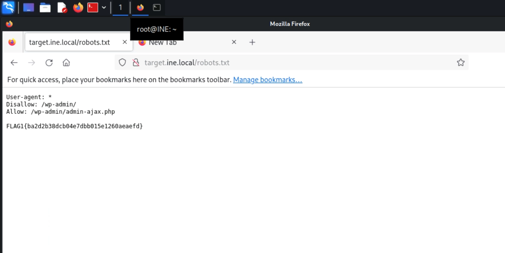
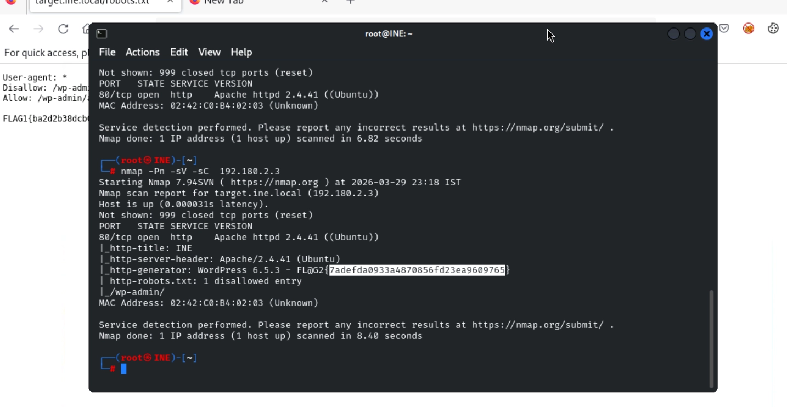
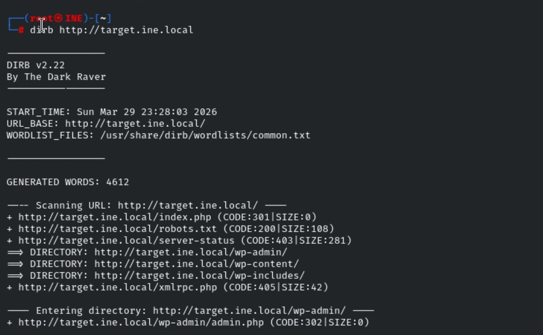
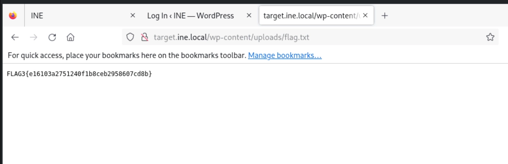
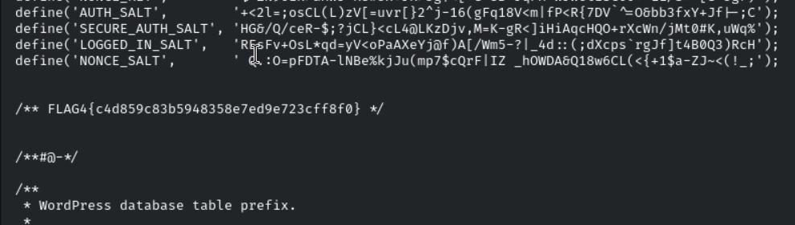
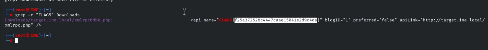

# Assessment Methodologies: Information Gathering CTF 1 Walkthrough

## Overview

This walkthrough documents the methodology used to solve the **Assessment Methodologies: Information Gathering CTF 1** Skill Check Lab. The objective was to perform passive and active reconnaissance against the target web application and capture all five flags hidden throughout the environment.

> **Disclaimer:** This assessment was performed in an authorized training environment provided by INE/eLearnSecurity for educational purposes only.

---

## Lab Environment

A web application was accessible at:

```text
http://target.ine.local
```

### Objectives

| Flag   | Description                                                                        |
| ------ | ---------------------------------------------------------------------------------- |
| Flag 1 | Discover information that instructs search engines what to crawl and what to avoid |
| Flag 2 | Identify the website technology and version                                        |
| Flag 3 | Locate directories exposed through directory browsing                              |
| Flag 4 | Find a backup file exposing sensitive configuration details                        |
| Flag 5 | Mirror the website and discover hidden information within downloaded files         |

---

# Flag 1 - Robots.txt Enumeration

One of the first files checked during web reconnaissance was the `robots.txt` file, which is commonly used to provide instructions to search engine crawlers regarding which resources should or should not be indexed.

Accessing the file revealed sensitive information and the first flag.

```bash
curl http://target.ine.local/robots.txt
```

The contents of the file disclosed the first flag.



---

# Flag 2 - Technology Fingerprinting

The next objective was identifying the web application and its version.

To accomplish this, I performed web fingerprinting using browser inspection techniques and HTTP response analysis.

Common tools that can be used include:

```bash
whatweb http://target.ine.local
```

or

```bash
curl -I http://target.ine.local
```

The gathered information revealed both the website technology and its version, which contained the second flag.



---

# Flag 3 - Directory Enumeration

To discover hidden directories and files, I performed directory brute-forcing using DIRB.

```bash
dirb http://target.ine.local
```

The scan identified several accessible directories, including one with directory listing enabled.

After browsing the exposed directory structure, I located the file containing the third flag.





---

# Flag 4 - Backup File Discovery

During directory enumeration, I noticed the presence of a backup file within the web root.

Backup files frequently contain sensitive information such as:

* Database credentials
* Configuration settings
* Source code
* Internal paths

After downloading and reviewing the backup file, I discovered configuration details that revealed the fourth flag.

<!--  -->



---

# Flag 5 - Website Mirroring

The final hint suggested that interesting information could be discovered by mirroring the website locally.

To achieve this, I used **HTTrack**, a tool designed to clone websites for offline analysis.

```bash
httrack http://target.ine.local
```

Once the website had been mirrored, I searched recursively through the downloaded files for interesting strings and potential flag values.

```bash
grep -r "flag" target.ine.local/
```

Alternatively, broader keyword searches can be performed:

```bash
grep -r "pattern" target.ine.local/
```

Reviewing the mirrored content revealed hidden information that was not easily accessible through normal browsing, leading to the discovery of the fifth flag.



---

# Key Takeaways

This lab highlighted several fundamental web reconnaissance techniques:

* Robots.txt enumeration
* Website fingerprinting
* Directory brute-forcing
* Discovery of exposed backup files
* Offline website analysis using HTTrack
* Recursive content searching with grep

Although these techniques are relatively simple, they frequently uncover sensitive information during real-world security assessments and should always be included in an information-gathering methodology.

## Skills Practiced

* Web Reconnaissance
* Information Gathering
* Technology Fingerprinting
* Directory Enumeration
* Sensitive File Discovery
* Website Mirroring
* Content Analysis
* HTTrack
* DIRB
* Linux Command-Line Tools
