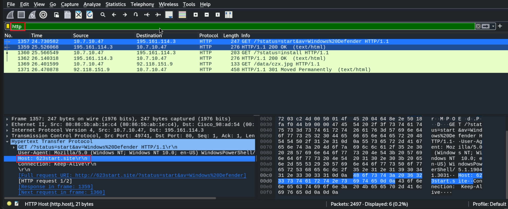
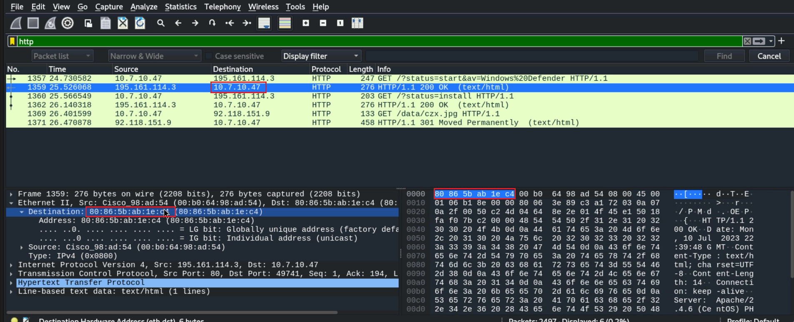
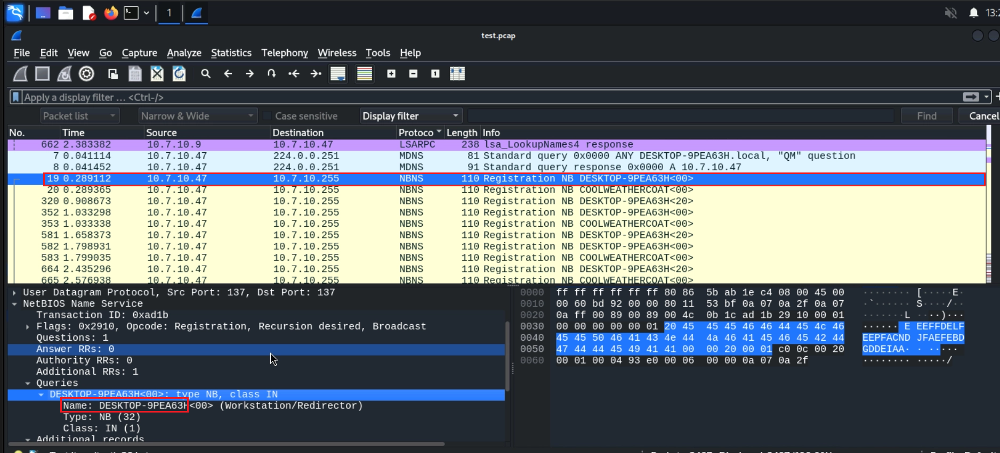
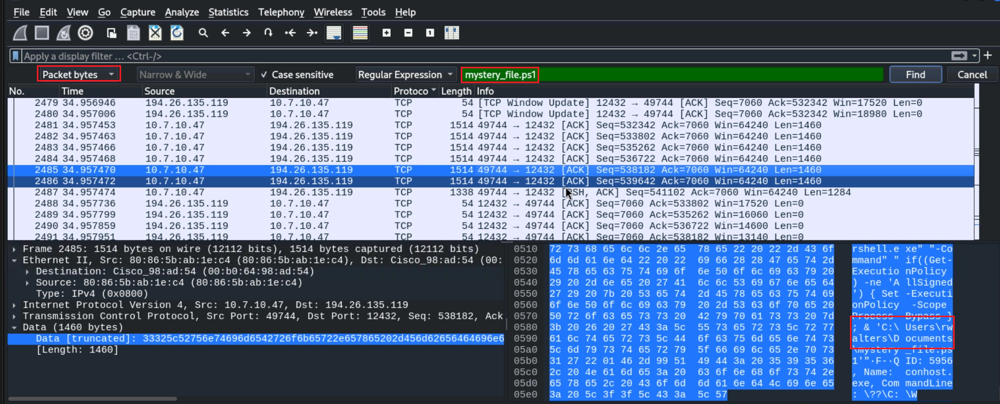
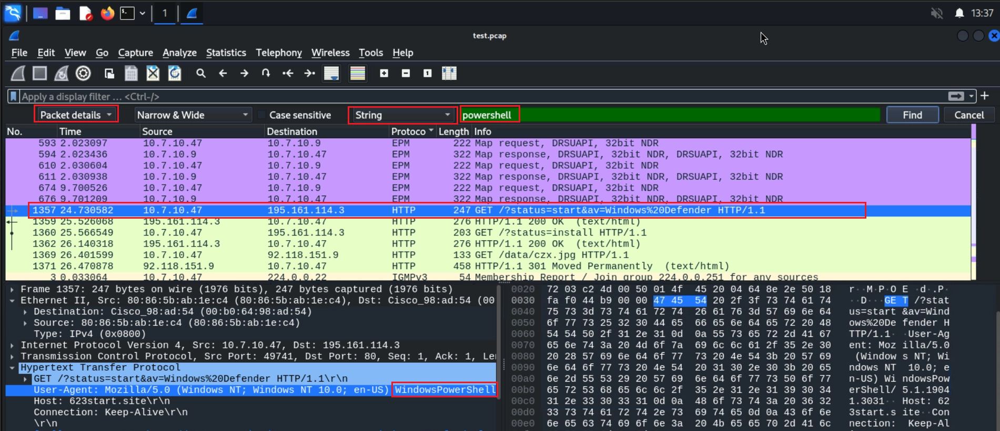
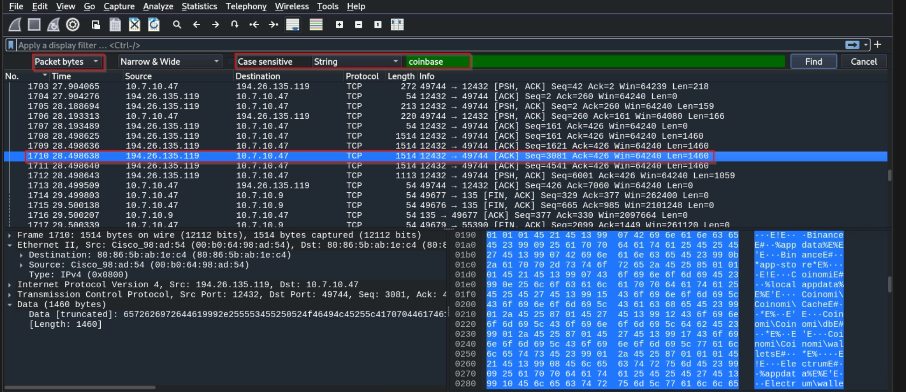
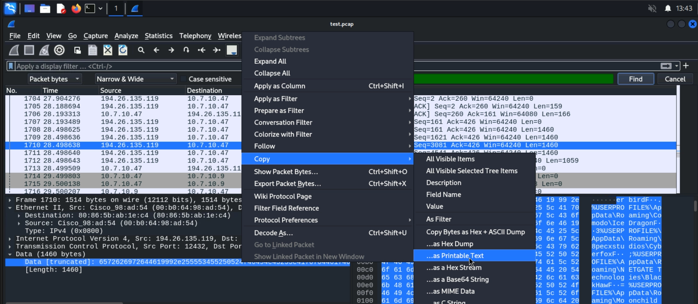
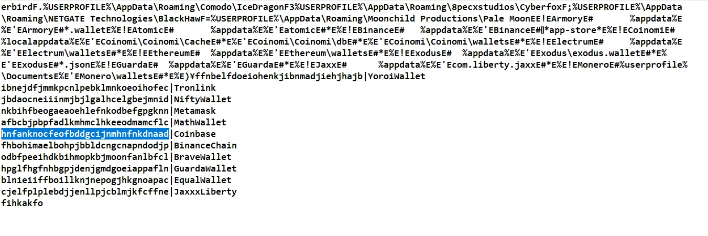

# Network-Based Attacks CTF 1 Walkthrough

## Overview

This walkthrough documents the methodology used to solve the **Network-Based Attacks CTF 1** Skill Check Lab from the eJPT course. The objective was to analyze captured network traffic and identify indicators of compromise related to a malware infection.

> **Disclaimer:** This writeup is intended for educational purposes only and was conducted in an authorized training environment provided by INE/eLearnSecurity.

---

# Lab Environment

The lab provided GUI access to a Kali Linux machine containing a packet capture file:

```text
test.pcap
```

The objective was to analyze the network traffic and capture all six flags.

## Objectives

| Flag | Objective |
|--------|-----------|
| Flag 1 | Identify the domain accessed by the infected user that returned HTTP 200 OK |
| Flag 2 | Identify the IP address and MAC address of the infected Windows client |
| Flag 3 | Determine the Wireshark filter used to identify the victim hostname and recover the hostname |
| Flag 4 | Identify the user who executed the PowerShell script `mystery_file.ps1` |
| Flag 5 | Identify the User-Agent string generated by the PowerShell traffic |
| Flag 6 | Identify the Coinbase Wallet browser extension ID |

---

# Initial Traffic Analysis

After launching the lab, a packet capture file named:

```text
test.pcap
```

was available for analysis.

The first step was to open the capture in Wireshark and begin examining the traffic for suspicious activity.

Since malware infections frequently communicate over HTTP, I started by filtering HTTP traffic to identify any interesting domains, downloads, or command-and-control communications.

---

# Flag 1 - Suspicious Domain Discovery

The first objective was to identify the domain accessed by the infected user that returned an HTTP **200 OK** response.

## HTTP Traffic Analysis

Apply the following Wireshark filter:

```text
http
```

While reviewing the HTTP requests and responses, a suspicious domain was identified that successfully returned a **200 OK** response.

### Flag 1

```text
623start.site
```

### Screenshot



---

# Flag 2 - Identifying the Infected Client

The second objective was to determine the IP address and MAC address of the infected Windows system.

By examining the packet details and tracing the suspicious traffic back to its source, the infected workstation was identified.

### Flag 2

```text
IP Address : 10.7.10.47
MAC Address: 80:86:5b:ab:1e:c4
```

### Screenshot



---

# Flag 3 - Recovering the Victim Hostname

The third objective required identifying the victim's hostname through NetBIOS Name Service traffic.

## NetBIOS Name Service Analysis

Apply the following Wireshark filter:

```text
nbns
```

NetBIOS Name Service traffic often reveals system hostnames during name registration and resolution processes.

While reviewing the NBNS packets, the hostname of the infected machine was discovered.

### Flag 3

```text
Filter   : nbns
Hostname : DESKTOP-9PEA63H
```

### Screenshot



---

# Flag 4 - Identifying the Infected User

The next objective was to determine which user executed the PowerShell script:

```text
mystery_file.ps1
```

## Searching the Capture

Since the script name was already provided in the challenge description, I used Wireshark's search functionality.

### Search Configuration

```text
Find Packet
Packet Bytes
String
mystery_file.ps1
```

The search results revealed a file path containing the username responsible for executing the script.

### Discovered Path

```text
C:\Users\rwalters\
```

### Flag 4

```text
rwalters
```

### Screenshot



---

# Flag 5 - PowerShell User-Agent Identification

The fifth objective was to determine the User-Agent string associated with the PowerShell-generated traffic.

## Traffic Analysis

Since PowerShell was already suspected, I searched the packet capture for references to:

```text
powershell
```

The matching packet was found within HTTP traffic.

Expanding the packet details under:

```text
Hypertext Transfer Protocol
```

revealed the User-Agent string used by the PowerShell process.

### Flag 5

```text
WindowsPowerShell
```

### Screenshot



---

# Flag 6 - Coinbase Wallet Extension ID

The final objective was to identify the browser extension ID associated with the Coinbase Wallet extension.

Initially, I had no immediate indication of where this information would be located.

Since Coinbase is a cryptocurrency platform, I suspected the malware might be collecting browser wallet extension data.

## Searching for Coinbase References

Using Wireshark's search feature, I searched packet contents for:

```text
coinbase
```

A matching packet was identified.

To make analysis easier, I copied the packet contents using:

```text
Right Click
→ Copy
→ Printable Text Only
```

and pasted the output into a local text editor.

While reviewing the extracted data, multiple cryptocurrency wallet extension identifiers were discovered.

### Wallet Extensions Observed

```text
ibnejdfjmmkpcnlpebklmnkoeoihofec | TronLink
jbdaocneiiinmjbjlgalhcelgbejmnid | NiftyWallet
nkbihfbeogaeaoehlefnkodbefgpgknn | MetaMask
afbcbjpbpfadlkmhmclhkeeodmamcflc | MathWallet
hnfanknocfeofbddgcijnmhnfnkdnaad | Coinbase
fhbohimaelbohpjbbldcngcnapndodjp | BinanceChain
odbfpeeihdkbihmopkbjmoonfanlbfcl | BraveWallet
hpglfhgfnhbgpjdenjgmdgoeiappafln | GuardaWallet
blnieiiffboillknjnepogjhkgnoapac | EqualWallet
cjelfplplebdjjenllpjcblmjkfcffne | Jaxx Liberty
```

### Flag 6

```text
hnfanknocfeofbddgcijnmhnfnkdnaad
```

### Screenshot





---

# Malware Analysis Observations

While analyzing the capture, it became apparent that the malware was collecting information related to cryptocurrency wallet browser extensions.

The traffic suggested that the attacker had successfully gained access to the victim machine and was harvesting wallet-related information, likely in an attempt to identify valuable cryptocurrency assets stored within browser extensions.

Several popular wallet extensions were identified, including:

* Coinbase Wallet
* MetaMask
* Binance Chain Wallet
* Brave Wallet
* TronLink
* Guarda Wallet
* Jaxx Liberty

This behavior is commonly associated with information-stealing malware targeting cryptocurrency users.

---

# Key Takeaways

This lab demonstrated several important network forensic and threat hunting concepts:

* Packet capture analysis with Wireshark
* HTTP traffic investigation
* NetBIOS Name Service analysis
* Host identification through network artifacts
* PowerShell activity detection
* Malware traffic analysis
* Cryptocurrency wallet reconnaissance
* Indicator of Compromise (IOC) identification

The most important lesson from this lab is that a packet capture often contains enough information to reconstruct the full attack chain, identify the infected user, determine the compromised host, and understand the attacker's objectives.

---


Happy Hacking! 