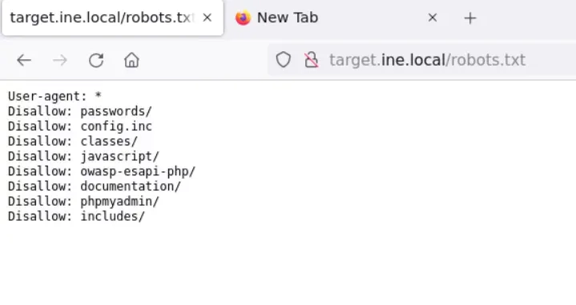
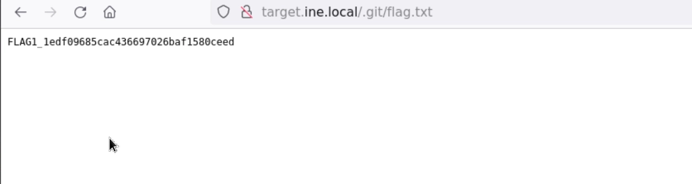
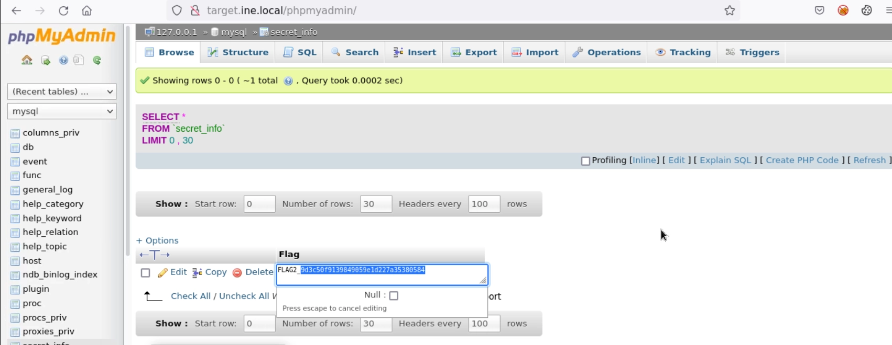
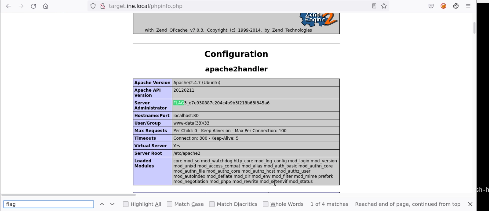
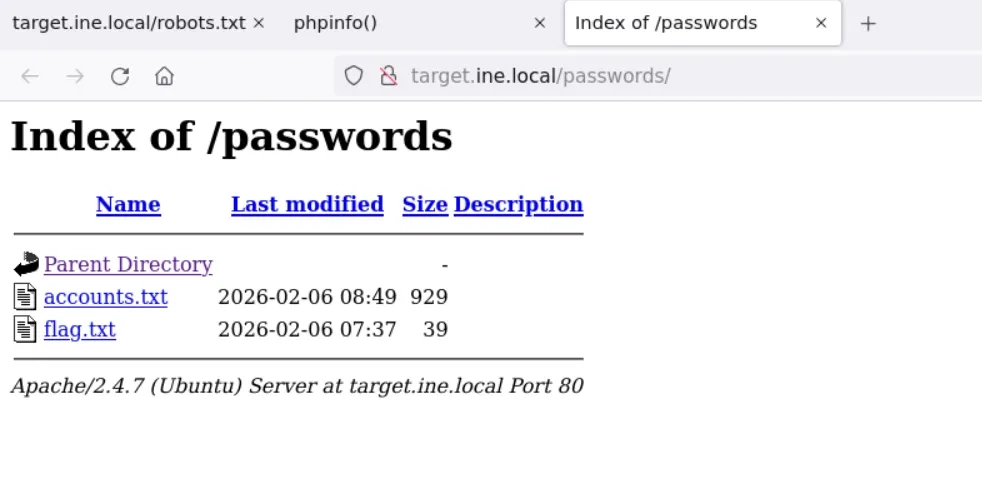
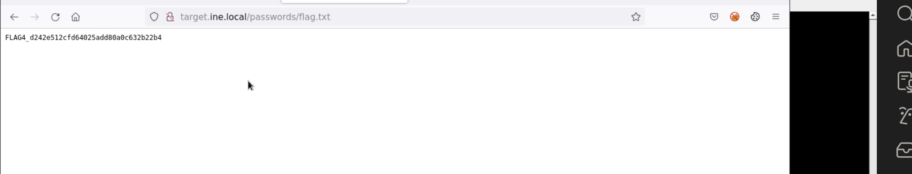

# Assessment Methodologies: Vulnerability Assessment CTF 1

## Overview

This lab focused on **vulnerability assessment** against a single web-facing Linux target. Rather than exploiting services for remote code execution, the goal was methodical enumeration — identifying exposed version control artifacts, insecure database access, information-disclosing PHP files, and sensitive directories left reachable through the web server. Every flag was reachable through careful observation and following enumeration leads rather than active exploitation.

**Objectives:**

- **Flag 1** — Locate version control artifacts exposed via the web server
- **Flag 2** — Find a flag hidden inside an insecure database backend
- **Flag 3** — Identify a PHP information file with something hidden in plain sight
- **Flag 4** — Search sensitive directories disclosed via `robots.txt`

---

## Enumeration

### Phase 1 — Port & Service Scan

A full service scan was run to identify what was running on the target:

```bash
nmap -sV -sC -p- -T4 target.ine.local
```

Key findings from the Nmap output:

- HTTP web server running on port 80
- `.git` directory accessible directly via the web server — a significant finding noted during initial review of the scan output
- Additional service banners and version strings captured for later reference

### Phase 2 — Directory Enumeration

Web content enumeration was performed to map out accessible paths on the web server:

```bash
dirb http://target.ine.local
```

This confirmed several paths of interest, including `/phpMyAdmin` and `/phpinfo.php`, both of which were also cross-referenced against `robots.txt`:

```bash
http://target.ine.local/robots.txt
```


`robots.txt` disclosed `Disallow` entries for paths the server operator wanted hidden from crawlers — but as always, listing a path in `robots.txt` advertises its existence rather than protecting it. Paths to investigate included `/phpMyAdmin/` and `/passwords/`.

---

## Flag 1 — Exposed `.git` Directory

While reviewing the Nmap output, a `.git` directory was found accessible at the web root. This is a serious misconfiguration: when a Git repository's `.git` folder is served by a web server, its entire history, commit messages, configuration files, and tracked file contents can be downloaded by anyone.

The directory was navigated to directly in the browser, and its contents inspected. Version control artifacts — commit history, config files, or tracked file contents — within the exposed repository contained the first flag.

```text
http://target.ine.local/.git/
```




> **Takeaway:** An exposed `.git` directory on a production web server is a critical finding. The entire repository history is recoverable — including code, credentials committed and later deleted, and internal hostnames or configuration values. Tools like `git-dumper` can automate full repository reconstruction from a web-accessible `.git` folder. Web server configurations should explicitly deny access to `.git` and other VCS directories.

---

## Flag 2 — Insecure Database Access (phpMyAdmin)

The hint referenced "data storage with loose security measures." During directory enumeration, both `dirb` and `robots.txt` confirmed that `/phpMyAdmin` was accessible. Navigating to it revealed a login interface — and weak or default credentials allowed entry.


Inside the phpMyAdmin interface, the available databases were explored. Inside the `mysql` database, a table named `secret_info` stood out immediately as non-standard:

```text
Database: mysql
Table:    secret_info
```

Querying the table revealed the second flag embedded in its contents.



> **Takeaway:** phpMyAdmin exposed on a web server without strong authentication is a critical vulnerability. Even with credentials required, weak or default passwords make it trivially bypassable. Database tables with names like `secret_info` or `credentials` should always be inspected during enumeration. In a real assessment, access to phpMyAdmin typically means full read/write access to every database on the host.

---

## Flag 3 — PHP Information File (`phpinfo.php`)

Directory enumeration surfaced a file called `phpinfo.php` in the web root. `phpinfo()` is a built-in PHP function that outputs a comprehensive page of server configuration data — PHP version, loaded modules, environment variables, compiled-in paths, and server settings. It is intended as a debugging tool and should never be left accessible in a production environment.

The page was loaded in the browser and carefully inspected. Scrolling to the **Configuration** section, the **Server Administrator** field contained the third flag — embedded in a configuration value where it would be invisible without reading through the full output:

```text
http://target.ine.local/phpinfo.php
```



> **Takeaway:** `phpinfo.php` files left in web roots are a common finding. Beyond potential flags in lab environments, in real assessments they expose the PHP version (enabling targeted exploit research), server paths (aiding local file inclusion attacks), enabled modules, environment variables, and occasionally credentials stored in `$_SERVER` globals. Any `phpinfo.php` file discovered should be flagged as high severity.

---

## Flag 4 — Sensitive Directory Disclosed by `robots.txt`

Revisiting the `robots.txt` `Disallow` entries, one path stood out: `/passwords/`. This is exactly the kind of directory an administrator might add to `robots.txt` hoping crawlers would ignore it — while inadvertently telling every attacker precisely where to look.

Navigating directly to the directory:

```text
http://target.ine.local/passwords/
```

Directory listing was enabled, making the contents of the folder fully visible without any authentication. Inspecting the files inside revealed the fourth flag.





> **Takeaway:** `robots.txt` `Disallow` entries are a roadmap to sensitive paths, not a security control. Any entry in `robots.txt` should be treated as a lead to investigate. Directory listing being enabled compounds the issue: once the path is known, every file inside is enumerable and downloadable without authentication.

---

## Flags Captured

| Flag | Location | Discovery Method | Value |
|---|---|---|---|
| Flag 1 | `.git` directory (web root) | Nmap output review | *(fill in from screenshot)* |
| Flag 2 | `mysql.secret_info` table | phpMyAdmin → database exploration | *(fill in from screenshot)* |
| Flag 3 | `phpinfo.php` → Server Administrator field | Directory enumeration → manual page review | *(fill in from screenshot)* |
| Flag 4 | `/passwords/` directory | `robots.txt` Disallow entry → directory listing | *(fill in from screenshot)* |


---

## Key Takeaways

- `robots.txt` `Disallow` entries are one of the first things to read on any web target. Every disallowed path is an implicit hint about what the server operator considers sensitive — and should be visited immediately.
- An exposed `.git` directory is a critical finding in any real assessment. Full repository history — including previously-deleted credentials, internal configuration, and source code — is recoverable from it.
- `phpinfo.php` files left on production servers disclose extensive server internals: PHP version, loaded modules, file system paths, and environment variables. Always check for this file during web enumeration.
- phpMyAdmin exposed publicly with weak credentials grants full database access. Any non-standard table name (`secret_info`, `credentials`, `admin_notes`) encountered during database exploration warrants immediate inspection.
- Directory listing enabled on sensitive directories means any known path becomes a full file browser. Combine this with a `robots.txt` disclosure and the attacker has both the path and full visibility of its contents.

## Skills Practiced

- Full TCP Port Scanning & Service Fingerprinting (Nmap)
- Web Directory Enumeration (Dirb)
- `robots.txt` Analysis & Path Discovery
- Version Control Artifact Exposure (`.git` directory)
- phpMyAdmin Enumeration & Database Inspection
- PHP Information Disclosure (`phpinfo.php`)
- Web Server Directory Listing Abuse
- Passive Information Gathering & Vulnerability Identification
- Manual Web Content Review & Analysis